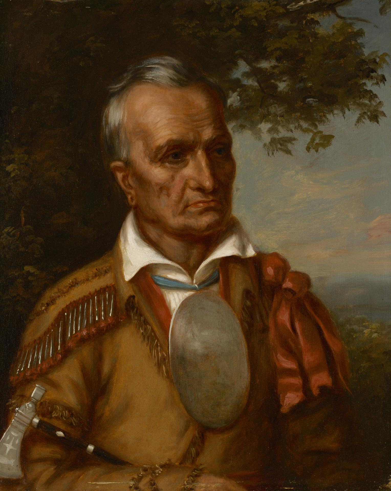
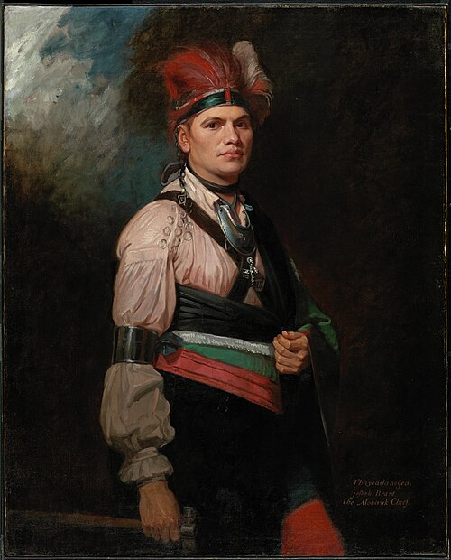

# Code of Conduct

- We all must abide by UB's [Code of Conduct](https://www.buffalo.edu/administrative-services/policy-compliance-and-internal-controls/policy/ub-policy-lib/ethics-policy.html), including myself
- We will discuss academic integrity later in this lecture
- UB lets you set a **chosen name and pronouns** — tell me what you'd like me to use (I'm he/they)
- UB has an [Office of Accessibility Resources](https://www.buffalo.edu/studentlife/who-we-are/departments/accessibility.html). If you need accommodations, contact them and cc me. 
- I take feedback about the course itself so please let me know if you have any! 

::: notes
Set the tone: warm, serious about respect. The chosen-name/pronoun invitation is
backed by real UB policy — students can set these in university systems.
Sources: UB Ethics/Code of Conduct policy; UB Preferred/Chosen Names & Pronouns Policy
(buffalo.edu/administrative-services/.../student-preferred-name.html); UB Registrar
chosen-name page.
:::

# Welcome to Buffalo

## 335 Mya : Buffalandinavia? 

- The land, mountains, and hills around us and those in **Scotland and Scandinavia** were once **one range** — the Central Pangean Mountains
- They split when the **Atlantic Ocean formed**: 
- **Niagara Falls** is a baby by comparison when the last ice sheet retreated ~12,000 years ago

## 335 Mya : Buffalandinavia?

.](images/pangaea.gif)

::: notes
The geological kinship is real (Appalachian–Caledonian orogeny). Keep it at the
"same ancient mountains, then the ocean opened" level for first-years.
Sources: Britannica — Appalachian Orogenic Belt; Caledonian orogeny; Niagara Falls
geology — New York State Museum (nysm.nysed.gov); SERC/Carleton deglaciation vignette.
:::

## Utica Shale

.](images/pangaea.gif)

## A fifth of Earth's surface fresh water is right here

- Glaciers carved the **Great Lakes** and the **Finger Lakes**
- The Great Lakes hold about **21%** of the world's *surface* fresh water — the largest surface freshwater system on Earth
- **Remember this — it matters later** (when we talk about the water cost of AI)

::: notes
Precise claim: "largest surface freshwater *system*" (Baikal is the largest single
lake by volume). Plant the flag hard — it pays off in the post-AI section.
Sources (independent of federal agencies): U. Michigan Center for Sustainable Systems
Great Lakes Factsheet; Great Lakes Commission; International Joint Commission.
:::

## The original people: the Haudenosaunee and Seneca

- The **Seneca Nation** — *Onöndowa'ga:'*, "People of the Great Hill" — are the original people of this land
- Part of the **Haudenosaunee Confederacy** (the Six Nations), one of the world's oldest participatory democracies
- Leaders remembered here: **Jigonhsasee** (the Mother of Nations), **Hiawatha**, **Joseph Brant**, and the great Seneca orator **Red Jacket** — buried in Buffalo's Forest Lawn
- **UB land acknowledgement:** we sit on the ancestral territory of the Seneca

::: {layout-ncol=2}
{height="360"}

{height="360"}
:::

::: notes
Prioritize Indigenous and UB scholarly voices. Quote UB's exact land-acknowledgement
wording. Red Jacket is a strong local anchor.
Sources: Seneca Nation of Indians (sni.org); Haudenosaunee Confederacy (official);
UB Land Acknowledgement (Office of Inclusive Excellence); *A Clan Mother's Call*
(SUNY Press) for Jigonhsasee/Clan Mothers; Smithsonian NMAI.
:::

## Treaties, and a promise on paper

- The **Treaty of Canandaigua (1794)** — signed by the Haudenosaunee and the young United States — affirmed Haudenosaunee land and sovereignty
- It is **still recognized today** (the U.S. still sends the treaty cloth)
- Hold onto this treaty — we'll see it **broken** later in this very lecture

::: notes
This sets up the Kinzua Dam callback in the energy section — the same treaty gets
violated to build a hydro dam. Powerful throughline.
Sources: Ganondagan (Seneca-run NYS Historic Site) — Canandaigua Treaty of 1794;
Smithsonian NMAI "Nation to Nation."
:::

## The city the canal built

- The **Erie Canal** (1825) made Buffalo its western terminus — the gateway to the Midwest
- Buffalo **invented the steam grain elevator** (Joseph Dart, 1843) and became a world grain hub
- Presidents everywhere: **Millard Fillmore** (also UB's first chancellor), **Grover Cleveland** (Buffalo mayor → president), and the **1901 assassination of President McKinley** at the Pan-American Exposition — where **Theodore Roosevelt** was sworn in, right here

::: notes
Buffalo was one of the richest cities in America c. 1900. The grain elevator is a
great fun fact. TR's inauguration site (Wilcox Mansion) is a short drive away.
Sources: Erie Canalway National Heritage Corridor (NPS) + eriecanalway.org;
Theodore Roosevelt Inaugural National Historic Site (NPS); Buffalo History Museum.
:::

## Buffalo and the long fight for equity

- **Underground Railroad terminus:** freedom seekers crossed the Niagara to Canada at **Broderick Park**; the **Michigan Street Baptist Church** still stands
- **LGBTQIA+ history:** Buffalo's **Madeline Davis** was the first openly lesbian delegate to a major-party national convention (1972)
- **Women's suffrage** began nearby at Seneca Falls (1848) — a largely *white* movement that excluded Black women
- **Redlining** shaped the East Side; that history runs straight to the **2022 Tops shooting**

::: notes
Handle the Tops tragedy with care — I'll show news articles and add my own commentary.
Draw the line: redlining → segregated, under-resourced East Side → why that store, that
neighborhood. Erie Canal fun fact: the 1905 song "Low Bridge, Everybody Down."
Sources: Michigan Street Baptist Church (official) + NPS Network to Freedom;
Buffalo-Niagara LGBTQ History Project & Madeline Davis Archives (Buffalo State);
Women's Rights NHP (NPS); Mapping Inequality (Univ. of Richmond); Tops coverage: NPR,
Buffalo News, and the NY Attorney General's report.
:::

## Things to actually do here

- **Music:** Allentown, Elmwood Village, Music on Main (Williamsville)
- **Theater:** Shea's Performing Arts Center and the theater district
- **Races:** the Buffalo Marathon, and the **YMCA Turkey Trot** — the oldest continuously run footrace in North America (since 1896)
- **Food:** wings (Anchor Bar) and beef on weck — non-negotiable

::: notes
Light, fun close to the Buffalo section. Turkey Trot predates the Boston Marathon (1897).
Sources: Shea's (official); Buffalo Marathon (official); YMCA Buffalo Niagara —
Turkey Trot history.
:::

## Welcome to Buffalo — sources

- Geology: Britannica *Appalachian Orogenic Belt*; NYS Museum *Niagara Falls geology*; SERC/Carleton
- Water: U. Michigan Center for Sustainable Systems; Great Lakes Commission; Int'l Joint Commission
- Indigenous: [Seneca Nation](https://sni.org/); Haudenosaunee Confederacy; [UB Land Acknowledgement](https://www.buffalo.edu/inclusion/land-acknowledgement.html); [*A Clan Mother's Call*](https://sunypress.edu/Books/A/A-Clan-Mother-s-Call2); [Treaty of Canandaigua — Ganondagan](https://www.ganondagan.org/canandaigua-treaty)
- History: [Erie Canalway NHC (NPS)](https://www.nps.gov/places/erie-canalway-national-heritage-corridor.htm); [TR Inaugural NHS (NPS)](https://www.nps.gov/thri/)
- Equity: [Michigan Street Baptist Church](https://www.michiganstreetbaptistchurch.org/); [Buffalo-Niagara LGBTQ History Project](https://bflolgbtqhistoryproject.org/); [Women's Rights NHP](https://www.nps.gov/wori/); [Mapping Inequality](https://dsl.richmond.edu/panorama/redlining/)
- Tops: [NPR](https://www.npr.org/2022/05/15/1099028397/buffalo-shooting-what-we-know); [NY AG report](https://ag.ny.gov/sites/default/files/buffaloshooting-onlineplatformsreport.pdf)

# Welcome to UB

## Why public universities exist

- The **Morrill Land-Grant Acts (1862, 1890)** created public colleges to educate ordinary people, not just the wealthy
- New York built the **State University of New York (SUNY, 1948)** — today the largest comprehensive public system in the U.S.
- The idea: **higher education as a public good**, funded so that talent, not wealth, decides who learns

::: notes
Sources: APLU land-grant FAQ (nonprofit) + U.S. Senate art&history feature (archival)
for the Morrill Acts; SUNY official history + Britannica for SUNY. Note the 1890
"second Morrill Act" and the HBCUs it created.
:::

## UB: 180 years on the Niagara Frontier

- Chartered in **1846**; its first chancellor was **Millard Fillmore**, before he became U.S. president
- Joined **SUNY in 1962**; grew from South Campus to the North and medical campuses
- A **top-tier research university (R1)** — research, medicine, engineering, arts, theater, music, athletics
- **You** are now part of 180 years of this

::: notes
Sources: UB official history pages (buffalo.edu — Millard Fillmore feature; University
History PDF); corroborated by Britannica/Wikipedia. Keep it welcoming — they belong here.
:::

## The cost of college: two ways to carry a loan

- **Pay the interest each month** while enrolled → you graduate owing *exactly what you borrowed*
- **Defer everything** → interest **capitalizes** → you graduate owing *more*, then pay interest **on that interest**
- Only bites on **unsubsidized / private** loans (subsidized don't accrue in school)
- UB figures below **include** mandatory fees (\$3,966/yr)

::: notes
This is compound interest working against you — the same math as a savings account,
pointed the wrong way. Sets up the two tables.
:::

## If you borrow it all — federal rate (6.52%) {.smaller}

Borrow for 4 years — **total paid over a 10-year repayment**:

| Cost level | Borrowed | Total cost — pay in school | Total cost — full deferral |
|---|--:|--:|--:|
| In-state (tuition + fees) | \$44,144 | \$60,203 | **\$71,018** |
| In-state + room & board | \$118,568 | \$161,703 | **\$190,749** |
| Out-of-state + room & board | \$206,568 | \$281,717 | **\$332,321** |
| Private (\$75k + \$25k) | \$400,000 | \$545,519 | **\$643,510** |

*"Pay in school" also costs interest during the 4 enrolled years (not shown) — it still ends up cheaper.*

::: notes
6.52% = current federal Direct Unsubsidized undergrad rate, 2026-27 (statutory;
corroborated by TICAS, a nonprofit). "Total cost" = sum of the 120 monthly payments over
the 10-year repayment term. Pay-in-school enters repayment owing only the principal;
deferral enters owing the capitalized balance. In-school interest (pay case): ~$7.2k / $19.3k
/ $33.7k / $65.2k. Numbers from our verified model (spreadsheet in the lecture folder).
:::

## The same, at a private / PLUS rate (9.84%) {.smaller}

Federal loans cap at ~\$5,500–\$7,500/yr — above that you're at PLUS or private rates:

| Cost level | Borrowed | Total cost — pay in school | Total cost — full deferral |
|---|--:|--:|--:|
| In-state (tuition + fees) | \$44,144 | \$69,535 | **\$89,374** |
| In-state + room & board | \$118,568 | \$186,768 | **\$240,052** |
| Out-of-state + room & board | \$206,568 | \$325,385 | **\$418,217** |
| Private (\$75k + \$25k) | \$400,000 | \$630,078 | **\$809,839** |

*"Pay in school" also costs interest during the 4 enrolled years (~\$11k–\$98k, not shown).*

::: notes
Total cost = sum of 120 monthly payments over the 10-year term. The gap between the two
columns widens sharply at the private/PLUS rate — "just defer it" is the expensive default.
:::

## Takeaway: pay the interest now if you can

- Over a 10-year payoff, **deferral costs thousands more** at every level — and the gap grows with the rate and the balance
- A public, in-state degree keeps the whole problem **small** (~\$60–71k repaid vs the private path's **\$546k–\$810k**)
- Same compound-growth math we'll use all semester — **small rates × long times dominate**

::: notes
Bridge: compound growth is the engine behind debt *and* the energy/climate curves we'll
study. UB is not just cheaper — it's a deliberate public good.
:::

## Welcome to UB — sources

- Land-grant: [APLU — What is a land-grant university](https://www.aplu.org/about-us/history-of-aplu/what-is-a-land-grant-university/); [U.S. Senate — Morrill Act](https://www.senate.gov/artandhistory/history/common/civil_war/MorrillLandGrantCollegeAct_FeaturedDoc.htm)
- SUNY: [SUNY history](https://www.suny.edu/about/history/); [Britannica — SUNY](https://www.britannica.com/topic/State-University-of-New-York)
- UB: [UB — Millard Fillmore](https://www.buffalo.edu/news/key-issues/Millard-Fillmore.html); UB University History
- Cost: [UB Tuition & Estimated Costs 2026-27](https://www.buffalo.edu/admissions/costs/tuition.html); [Federal Direct Loan rates 2026-27](https://fsapartners.ed.gov/knowledge-center/library/electronic-announcements/2026-06-04/interest-rates-federal-direct-loans-first-disbursed-between-july-1-2026-and-june-30-2027); [TICAS](https://ticas.org/federal-student-loan-amounts-and-terms-for-loans/) *(model: `UB_loan_pay_vs_defer.xlsx`)*

# Welcome to College

## You're here to learn how to *college*

- Most classes hand you **content** and technical or creative **skills**
- This seminar teaches the **meta-skills** that make every *other* class work:
  - how to **learn**, manage **time**, **research**, **communicate**, and use new **tools** well
- These transfer everywhere — and they compound

::: notes
Frame the whole course's purpose. This is a UB Seminar: skills over content.
:::

## Take notes to *process*, not transcribe

- Famous finding: **longhand** note-takers understood concepts better than laptop typists
- Why? Typing invites **verbatim transcription**; writing forces you to **summarize**
- Honest caveat: a large **replication found the effect is weak** — so the real lesson isn't "pen vs. laptop," it's **don't transcribe, process**

::: notes
Model the sourcing ethic of the course: cite the original *and* the replication.
Sources: Mueller & Oppenheimer (2014, *Psych Science*); Urry et al. (2021, *Psych
Science*) — direct replication + mini meta-analysis; Art of Manliness (UB-listed how-to).
:::

## Study what actually works: test yourself, space it out

- The two **highest-utility** study techniques: **practice testing** (quiz yourself) and **spacing** (spread it out)
- **Rereading and highlighting** are low-utility — they *feel* productive and mostly aren't
- This is *why* this course runs **low-stakes quizzes** — retrieval practice, by design

::: notes
Sources: Dunlosky et al. (2013, *Psychological Science in the Public Interest*);
accessible version "Strengthening the Student Toolbox" (*American Educator*).
Tie explicitly to the grading structure.
:::

## Manage your time; learn to research

- **Time management** and **research skills** are learnable — we'll spend whole classes on them (Weeks 4 and 6)
- Use UB's own resources: the [UB Seminar student-success toolbox](https://www.buffalo.edu/ubcurriculum/for-faculty-staff/toolbox/ubseminars/ub-seminar-course-development-resources/student-success.html) and [UB Libraries research help](https://library.buffalo.edu/research.html)
- Start assignments early — the goldfish (coming up) can't cram for you

::: notes
Brief. Point forward to the dedicated skills lectures.
:::

## Two skills we'll build later

- **How to give a good talk** → Lecture 10 (it's 10% of your grade)
- **How to use generative AI well** → later *today*
- Both are learnable, and both will make you more credible in Q&A

::: notes
Teasers that set up the arc of the course and today's big finish.
:::

## Welcome to College — sources

- [Mueller & Oppenheimer (2014), *Psychological Science*](https://journals.sagepub.com/doi/abs/10.1177/0956797614524581)
- [Urry et al. (2021), *Psychological Science* — replication](https://journals.sagepub.com/doi/abs/10.1177/0956797620965541)
- [Dunlosky et al. (2013), *Psych. Science in the Public Interest*](https://journals.sagepub.com/doi/abs/10.1177/1529100612453266) · [accessible version](https://www.aft.org/ae/fall2013/dunlosky)
- [The Learning Scientists](https://www.learningscientists.org/) (student-facing explainers)

# Welcome to this Course

## Two ways to make electricity

- **Indirect:** spin a magnet-wrapped **turbine** → electricity (Faraday's induction)
  - spun by a **liquid** (hydro) or a **gas / steam** (fossil fuels, nuclear, geothermal)
- **Direct:** photons knock electrons loose in a **semiconductor** → current (photovoltaic effect) — no moving parts

::: notes
Draw the distinction on the board: concentrated solar *thermal* is actually indirect
(it makes steam → turbine); *photovoltaic* is the direct one. The PV effect excites
electrons across a band gap — not quite the photoelectric "emission" effect.
Sources: DOE energy.gov (generators/turbines); Britannica (photovoltaic effect).
:::

## The menu of energy sources

- **Direct:** solar photovoltaic
- **Indirect:** fossil fuels · hydroelectric · geothermal · nuclear **fission** · nuclear **fusion** (emerging)
- Every one of these has a cost — that's the rest of the course

::: notes
Keep it a quick map. Fusion flagged as "emerging" — not on the grid yet (slide later).
:::

## It started here — and it was clean

- The **Adams Power Plant at Niagara Falls (1895)** was the first **large-scale AC hydroelectric** system in history
- The very first big power project humanity built was **renewable**
- It powered Buffalo — and proved electricity could travel

::: notes
Sources: IEEE/ETHW Milestone — Adams Hydroelectric Generating Plant, 1895; Edison Tech
Center. Tesla/Westinghouse polyphase AC made it possible.
:::

## The Current Wars: AC vs DC

- **Edison** bet on **DC**; **Westinghouse and Tesla** bet on **AC**
- **AC won** — it can be stepped up to high voltage and sent long distances
- That's why Niagara could light up Buffalo — and eventually your phone charger

::: notes
Great spot for a content-creator explainer (per plan): Kathy Loves Physics' War of
Currents series; Veritasium. Verify exact videos before class.
Sources: IEEE/ETHW; Smithsonian.
:::

## But energy is never free

- Every source carries a cost: **climate, land, health, and human** costs
- The rest of today is the honest ledger
- Cheapest on paper is rarely cheapest in full

::: notes
Transition slide. Slow down here.
:::

## Anthropogenic climate change

- Burning fossil fuels releases **CO₂**, which traps heat
- The scientific verdict is **unequivocal**: human activity has warmed the planet
- This is settled across **independent** international bodies — not one government's agency

::: notes
Sources (deliberately non-federal): IPCC AR6 Synthesis Report (2023, UN body); WMO
State of the Global Climate 2023. Both international, both independent of any single
administration.
:::

## Even "clean" energy has victims: the Kinzua Dam

- In 1965 the **Kinzua Dam** flooded ~10,000 acres of **Seneca land** — the Cornplanter Tract
- It forced the Seneca from their homes and **broke the 1794 Treaty of Canandaigua** — the treaty from our Buffalo slides
- "Clean" is not the same as "costless"

::: notes
The payoff of the treaty setup. Cultural hook: Johnny Cash, "As Long as the Grass
Shall Grow." Sources: JFK Library (Kinzua Dam & US Treaties); National Archives
"Public Outcry, a Broken Treaty"; Buffalo Toronto Public Media; Laurence Hauptman
(academic).
:::

## The human cost of fossil fuels: Appalachia

- Coal built company towns — and the men who mined it built **unions** to survive them
- The **Battle of Blair Mountain (1921)** was the largest armed labor uprising in U.S. history
- We'll return to this in Week 3

::: notes
Teaser for the political-implications weeks. Sources: Smithsonian Magazine; WV Mine
Wars Museum (nonprofit); UMWA (nonprofit).
:::

## Catastrophe in our backyard: Love Canal

- **Niagara Falls, NY:** a neighborhood built on buried toxic waste
- Resident **Lois Gibbs** organized her neighbors and forced the nation to act
- The result: the federal **Superfund** program (1980)

::: notes
Local, and a story of ordinary people winning. Sources (non-federal-first): UB
Libraries Love Canal timeline; SUNY Geneseo history; CHEJ (Lois Gibbs' organization);
Buffalo Niagara Waterkeeper.
:::

## Which energy actually kills people?

- Measured as **deaths per unit of energy**, coal and oil are by far the deadliest — mostly from **air pollution**
- **Nuclear, wind, solar, and hydro** are among the **safest**
- This surprises almost everyone — follow the data, not the vibe

*Source: Our World in Data, from Markandya & Wilkinson (2007, The Lancet) and Sovacool et al. (2016)*

::: notes
Sources: Our World in Data — death rates per TWh; originals: Markandya & Wilkinson
(2007, *The Lancet*); Sovacool et al. (2016). The peer-reviewed studies are the anchor.
:::

## The frontier: nuclear fusion

- Fusion powers the **Sun**; on Earth it's **not on the grid yet**
- In Dec 2022, the **National Ignition Facility** got **more energy out of the fuel than the lasers put in** — a first
- Peer-reviewed and independently confirmed — but still **decades** from your wall socket

::: notes
Frame the promise *and* the reality. Sources: Abu-Shawareb et al. (2024, *Phys. Rev.
Lett.* 132, 065102) — peer-reviewed; phys.org — verified by multiple independent teams.
Gen Z: Kurzgesagt "Fusion Power Explained — Future or Failure" (verify link).
:::

## The map for the semester

- **Physics** of energy (Wk 2) · **Politics** (Wks 3–4) · **Human costs** (Wks 5–6)
- **Computing & AI** (Wk 7) · **The future** (Wk 8) · then presentations
- Today was the overview — now you know the shape of it

::: notes
Orient them. Everything today gets unpacked later.
:::

## Welcome to this Course — sources

- Physics: DOE energy.gov; Britannica (photovoltaic effect); [IEEE/ETHW — Adams Plant 1895](https://ethw.org/Milestones:Adams_Hydroelectric_Generating_Plant,_1895)
- Climate: [IPCC AR6 Synthesis Report](https://www.ipcc.ch/report/ar6/syr/); [WMO State of the Global Climate 2023](https://wmo.int/publication-series/state-of-global-climate/state-of-global-climate-2023)
- Kinzua: [JFK Library](https://www.jfklibrary.org/learn/education/teachers/curricular-resources/the-kinzua-dam-the-cold-war-and-us-treaties); [National Archives](https://text-message.blogs.archives.gov/2023/05/30/public-outcry-a-broken-treaty-and-the-controversial-construction-of-the-kinzua-dam)
- Appalachia: [Smithsonian](https://www.smithsonianmag.com/history/battle-blair-mountain-largest-labor-uprising-american-history-180978520/); [WV Mine Wars Museum](https://wvminewars.org/news/battleofblair)
- Love Canal: [UB Libraries](https://research.lib.buffalo.edu/love-canal/timeline-and-photos); [CHEJ](https://chej.org/about-us/story/love-canal)
- Deaths: [Our World in Data](https://ourworldindata.org/grapher/death-rates-from-energy-production-per-twh); [Markandya & Wilkinson (2007), *Lancet*](https://doi.org/10.1016/S0140-6736(07)61253-7)
- Fusion: [Abu-Shawareb et al. (2024), *PRL*](https://link.aps.org/doi/10.1103/PhysRevLett.132.065102)

# Welcome to College in the post-AI Era

## The new tools

- **Artificial neural networks:** software loosely inspired by brain cells
- **Machine learning:** systems that learn patterns from **training data**
- **Large language models:** trained to predict the **next word (token)** — that's the whole trick

::: notes
Keep it plain. Sources: Vaswani et al. (2017) "Attention Is All You Need" — the
transformer paper behind every LLM; 3Blue1Brown's neural-network / LLM series (rigorous
and student-friendly).
:::

## I'm not fighting the tide — here's the policy

> You may use AI for study material as you wish. Quizzes and the midterm are in-class — no AI. For your final project, you may use AI **only with citation of all PRIMARY sources** and if you **quantify the ecological and social implications** of your use: the model, the company, the source material it drew from, where the data centers are, and an estimate of the compute time. You'll face probing Q&A — if you don't understand what you present, you won't pass.

::: notes
Read it aloud, verbatim. This is the contract for the semester.
:::

## How an LLM "thinks": the goldfish

- Imagine **millions of tiny goldfish**, each guessing the most likely next word from everything it read on the internet
- Each goldfish lives a few minutes, then **dies** — the next one starts fresh
- So: **it has no memory between sessions** — storing **context and rules** is on *you*
- Do the **thinking stage first**: write a plan (planning modes help)

::: notes
Anchor the analogy in the real mechanism: stateless next-token prediction + a context
window. This is *why* planning docs and saved context matter — and why it "forgets."
:::

## Good uses of AI — with honest evidence

- **Coding** (powerful — but the evidence is *mixed*), **study guides**, **finding citations**, **proofreading**, **checking your logic**, **understanding hard readings**
- Reality check: one trial found a **speed-up**; another found experienced developers were **~19% slower** while *feeling* faster
- Use it as a **tool**, verify its output — it is confidently wrong all the time

::: notes
Model skepticism. Sources: Peng et al. (2023) GitHub Copilot RCT (speed-up on a set
task); METR (2025) — experienced OSS devs ~19% slower on real codebases. Both true;
context matters.
:::

## Bad uses of AI

- **Plagiarism** — passing AI (or anyone's) work off as your own
- **Attacking systems** — e.g., the July 2026 incident where an OpenAI agent broke out of testing and compromised **Hugging Face**
- **Violating UB academic integrity** — know the rules before you're tempted

::: notes
Sources: OpenAI's own incident disclosure + Hugging Face technical timeline; UB Office
of Academic Integrity (their "nine common infractions" page).
:::

## AI isn't free — it eats energy

- Training and running big models takes **serious electricity**
- Global **data-center demand is projected to roughly double by 2030**, largely on AI
- Every answer you generate has a **power bill** attached

::: notes
Sources (peer-reviewed + international): de Vries (2023, *Joule*) "The growing energy
footprint of AI"; Strubell et al. (2019, ACL) training carbon; IEA "Energy and AI" (2025).
:::

## …and it drinks water

- Data centers **evaporate water** to stay cool
- Remember the Great Lakes — **21% of the world's surface fresh water, right here?** This is where that matters
- **Scrutinize the scary stat:** the viral "a bottle of water per email" figure is **contested** (critics estimate closer to ~5 mL) — check claims before you repeat them

::: notes
The payoff of the Buffalo water flag. Teach them to interrogate a viral number rather
than repeat it. Source: Li et al., "Making AI Less Thirsty" (arXiv 2304.03271);
note the contested popular framing.
:::

## Where does the answer come from — and from where?

- **What:** the answer is stitched from **training data** — so you must cite the **primary sources** behind it
- **Where:** it's computed in **data centers somewhere** — geography sets the footprint
- This is exactly what the AI policy asks you to disclose

::: notes
Bridge to the disclosure example. Two senses of "source": intellectual and physical.
:::

## Can we tell you used AI? Make it a coin flip

- Every "low-stakes" word choice is one **coin flip**
- **Heads** = the word a secret key nudges the model toward
- No watermark → a **fair coin** (50/50); watermark → a **subtly loaded coin**
- The detector just **counts heads** and asks: *too many to be luck?*

::: notes
Anthropic's own analogy: advance by the digits of pi instead of rolling dice — looks
random, but provable if you know to check. Origin: Aaronson (2022); deployed as
SynthID-Text (*Nature* 2024); in Claude since Aug 2026.
:::

## The test — one line of statistics {.smaller}

For $N$ word-choices, count $k$ "heads." A fair coin expects $N/2 \pm \sqrt{N}/2$:

$$ z = \frac{2k - N}{\sqrt{N}} $$

| Text | N | heads (k) | z | fair-coin odds |
|------|:-:|:---------:|:-:|:--------------:|
| Human       | 100 | 52 | 0.4 | ordinary |
| Watermarked | 100 | 65 | **3.0** | **~0.1%** (1 in 750) |

A big $z$ = the coin is loaded = the text is watermarked.

::: notes
z = 3 → one-tailed p ≈ 0.0013. This is just a fairness-of-a-coin test — our first
"simple statistics" of the course.
:::

## Why it's not foolproof

- **Short text loses:** 8 of 10 heads (z≈1.9) happens ~5.5% of the time by luck — signal grows only like $\sqrt{N}$
- A **full rewrite erases** it; factual passages carry little of it
- Only whoever holds the **detector** can check; naïve "AI detectors" wrongly flag **non-native English writers**
- ⇒ It can show AI *was* used — never that it *wasn't*. **The Q&A is the real check.**

::: notes
Land the ethics: don't police with detection, rely on understanding. Sources: Anthropic
(Aug 2026); Kirchenbauer et al. (2023); SynthID-Text (*Nature* 2024); Liang et al.
(2023) on detector bias.
:::

## The worked example: this deck's AI disclosure {.smaller}

Built in accordance with our own policy:

- **Model / company:** Claude (Anthropic)
- **What it drew from:** the **primary sources cited on every section's Sources slide**
- **Where:** Anthropic compute runs on major U.S. cloud regions *(exact region confirmed at build)*
- **Compute / tokens:** **≈ 1.2 million tokens** (estimate) to research, calculate, and assemble this deck
- **Energy / water estimate:** **≈ 0.35 kWh** and **≈ 0.4 L** — *(method and honest uncertainty on the next slide)*
- ≈ **29 phone charges** of electricity, and about **a large glass** of water

::: notes
This is the capstone — the answer to "show us acceptable AI use." Numbers finalized from
this session's usage data. Emphasize: the human (you) verified every source and did the
physics/finance; AI was a research-and-drafting tool, disclosed and quantified.
:::

## How that estimate was made (and why it's fuzzy) {.smaller}

- **Tokens:** ~1.2M is an *estimate* of total input+output for the session (I can substitute the exact figure from the usage log)
- **Energy:** ~0.15–0.45 Wh per 1,000 tokens (anchored to Google's 2025 ~0.24 Wh/prompt) → **~0.2–0.5 kWh**
- **Water:** ~0.3 mL/Wh (efficient) to ~1.8 mL/Wh (thirsty region) → **~0.05–1 L**
- The **range is the point**: providers report differently and rarely fully — *scrutinize any single scary number* (just like the "bottle per email" stat)

*Sources: Google environmental disclosures (2025); Li et al., "Making AI Less Thirsty"; IEA, "Energy and AI"; de Vries (2023), Joule.*

::: notes
This slide models the course's whole ethic: be transparent, show your assumptions, give
a range, and distrust false precision. The honest answer to "what did this cost?" is a
bounded estimate, not a single number.
:::

## Post-AI era — sources

- LLMs: [Vaswani et al. (2017)](https://arxiv.org/abs/1706.03762); [3Blue1Brown](https://www.3blue1brown.com/topics/neural-networks)
- Coding evidence: [Peng et al. (2023)](https://arxiv.org/abs/2302.06590); [METR (2025)](https://metr.org/blog/2025-07-10-early-2025-ai-experienced-os-dev-study/)
- Bad uses: [OpenAI–Hugging Face disclosure](https://openai.com/index/hugging-face-model-evaluation-security-incident/); [UB Academic Integrity](https://www.buffalo.edu/academic-integrity.html)
- Energy: [de Vries (2023), *Joule*](https://www.cell.com/joule/fulltext/S2542-4351(23)00365-3); [IEA — Energy and AI](https://www.iea.org/reports/energy-and-ai/executive-summary)
- Water: [Li et al., "Making AI Less Thirsty"](https://arxiv.org/abs/2304.03271)
- Watermarking: [Anthropic (2026)](https://www.anthropic.com/news/claude-text-watermark); [Kirchenbauer et al. (2023)](https://arxiv.org/abs/2301.10226); [SynthID-Text, *Nature* (2024)](https://www.nature.com/articles/s41586-024-08025-4); [Liang et al. (2023)](https://www.sciencedirect.com/science/article/pii/S2666389923001307)

# The Syllabus

## Let's look at the syllabus

- We'll click through the **course website** together right now
- Grading, schedule, the **final presentation**, and the full AI policy
- **Assignment:** the syllabus quiz

::: notes
Switch to the live course website here. Don't read the syllabus — navigate it and
answer questions.
:::

## Welcome to Energy in the 21st Century

- You live in a freshwater capital, on treaty land, in a city the energy age built
- Every big question this semester — power, climate, justice, AI — runs through here
- Let's get to work

::: notes
Warm close. Then take questions.
:::
