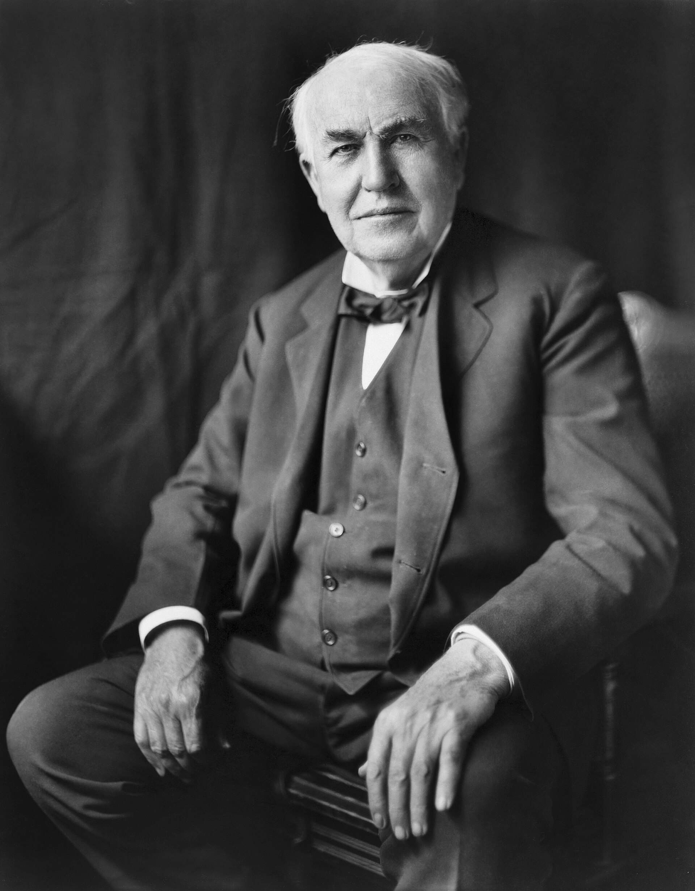
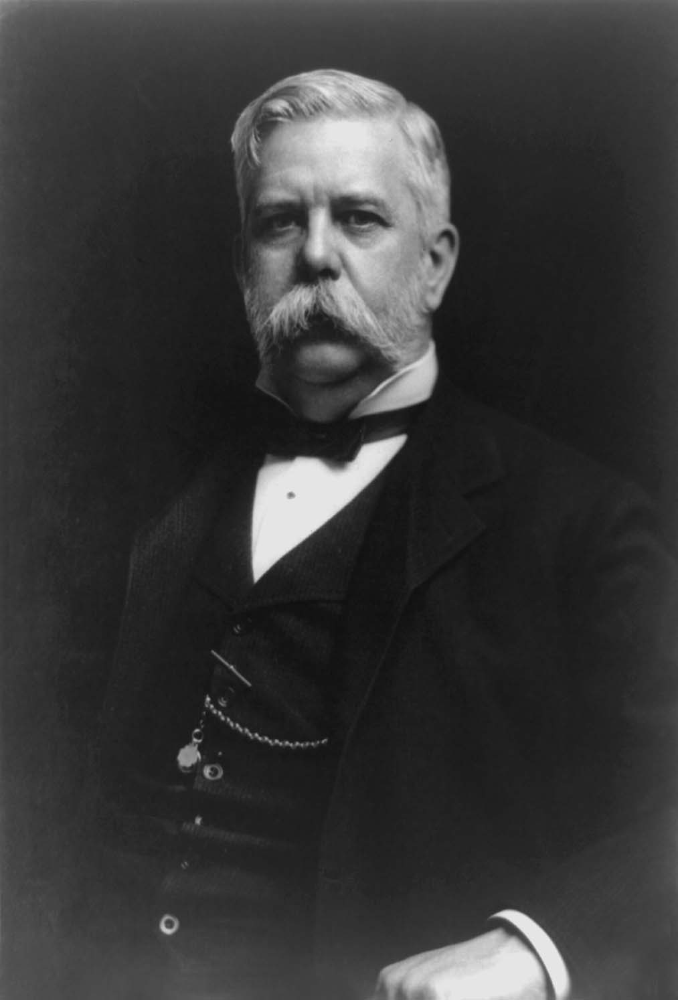
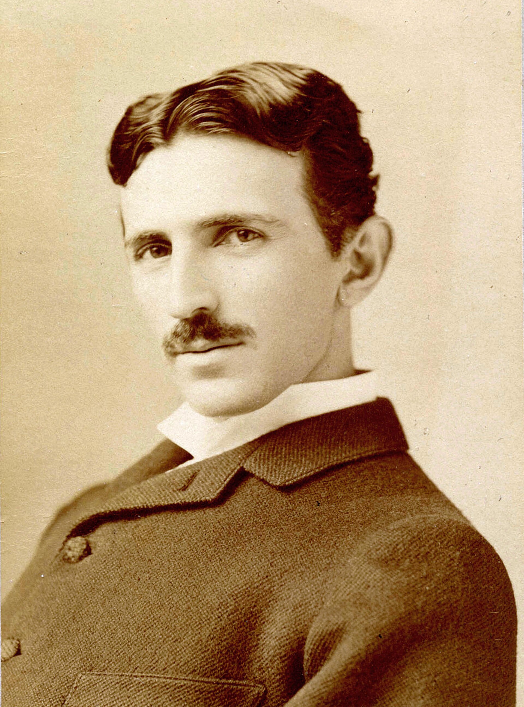
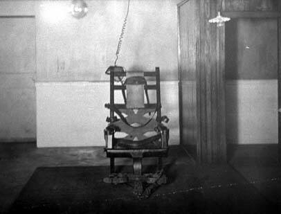

<!--
QUARRY NOTE (for Sal): this .qmd mirrors the 24 slides Claude appended to
lecture03_war_of_the_currents_acdc.pptx (the built pptx is the source of truth;
this is your editable draft). Section = War of the Currents (AC vs DC), 1882-1896.
Images fetched to images/: edison.jpg, westinghouse.jpg, tesla.jpg, electric_chair.jpg
(all public domain). Missing figures are marked "FIGURE TO ADD" - re-run
fetch_lecture_media.py in discovery mode on "War of the currents" for exact titles.
The fetched File:Kemmler.jpg is NOT William Kemmler (it's a modern musician) - do not use.
-->

# The War of the Currents {.divider}

AC vs. DC, 1882-1896

## The War of the Currents: What Were They Fighting Over?

- Should the electricity in your walls be **direct current (DC)** or **alternating current (AC)**?
  - DC (Edison): flows one way, like a battery. Hard to change voltage, so it dies within ~1 mile of the plant.
  - AC (Westinghouse/Tesla): reverses ~60x per second. A transformer steps it up to high voltage for cheap long-distance travel, then back down at your house.
- Recall Lecture 2: power lost in a wire is $P = I^2 R$. High voltage = low current = low loss. **That is AC's whole advantage.**
- *This will be relevant for our discussion about* who decides which technology wins — physics, or money.

::: notes
Frame the stakes: physics (I²R, transformers) decides the engineering; corporate finance decides the market. Both threads run through this section. Source: War of the currents (Wikipedia), traced to McNichol 2006 / Jonnes 2003.
:::

## 1882: Edison Builds the First Grid (DC)

- **Sept 1882: Edison's Pearl Street Station**, NYC — the first investor-owned electric utility. 110 volts DC.
- Brilliant for dense Manhattan blocks; useless for a town 10 miles away — low-voltage DC can't travel.
- Edison had a working business and a wall of patents to protect. Remember that — it explains everything he does next.

::: notes
McNichol (2006) p.80 on Edison's DC design; Jonnes (2003). Pearl Street opened Sept 4, 1882. Commercial lock-in matters as much as the physics. FIGURE TO ADD: Pearl Street Station illustration.
:::

## 1885-1886: Westinghouse Bets on AC

- 1885: Westinghouse buys U.S. rights to the **Gaulard-Gibbs transformer** and hires engineer **William Stanley**.
- March 1886: Stanley lights **Great Barrington, MA** — 500 V down the street, stepped to 100 V for the shops. Proof AC could travel far, then be made safe at the wall.
- Fall 1886: Westinghouse, Stanley & Oliver Shallenberger build the first commercial AC system — **in Buffalo, NY.**
- End of 1887: Westinghouse 68 AC stations vs. Edison 121 DC. AC is catching up fast.

::: notes
Buffalo throughline #1: first commercial AC system was here. McNichol (2006) p.81; Essig (2009). Great Barrington = first practical US AC demo.
:::

## 1886-1888: Edison Goes Negative

- Nov 1886, Edison privately: *"Just as certain as death Westinghouse will kill a customer"* within six months.
- Feb 1888: Edison Electric publishes an 84-page pamphlet, *"A Warning"* — part patent threat, part fear campaign cataloguing AC deaths.
- The play: if you can't beat AC on cost or physics, brand it as **the current that kills.**
- Blunt version: this is a 19th-century corporate disinformation campaign.

::: notes
Nov 1886 letter to Edward Johnson, quoted in Jonnes (2003). Johnson authored the Feb 1888 "A Warning" pamphlet. Keep the editorial tone; facts are solid.
:::

## 1888: Enter Harold Brown

- June 1888: engineer **Harold P. Brown** attacks AC in the *New York Post* and lobbies NYC to cap AC at 300 V — which would make long-distance AC useless.
- Secretly bankrolled and equipped by Edison's company: treasurer Francis Hastings brokered it; Edison lent his West Orange lab and assistant Arthur Kennelly.
- Brown stages public animal electrocutions as "proof" AC is deadlier than DC (see the electric-chair section).

::: notes
Carlson (2003); Essig (2009) on the Edison-Brown alliance. Collusion later proven by stolen letters (Aug 1889, NY Sun). The "manufactured expert" story.
:::

## 1889: The Tide, the Panic, and the Chair

- May 1889: **William Kemmler** sentenced to die in the new electric chair.
- Oct 11, 1889: lineman **John Feeks** electrocuted in a tangle of Manhattan wires in front of a crowd — sparking the "Electric Wire Panic."
- Jan 1889: **Edison General Electric** formed — backed by J.P. Morgan and the Vanderbilts — and Edison starts losing control of his own company.

::: notes
1889 is the hinge year: the chair, the Feeks panic, and the merger that sidelines Edison all land together. Klein (2010); Jonnes (2003).
:::

## 1890-1891: AC Wins on the Merits

- Aug 6, 1890: Kemmler executed by AC — a botched, grisly spectacle meant to smear AC. It didn't stop AC's spread.
- 1891: Dolivo-Dobrovolsky demonstrates **three-phase AC** — 176 km transmitted at ~75% efficiency. The long-distance problem is solved. DC has no answer.
- Even Edison's own Machine Works quietly starts building AC gear (Oct 1890).

::: notes
The 1891 Lauffen-to-Frankfurt three-phase demo is the technical turning point. Hughes (1993). Irony: the execution PR backfired.
:::

## 1892-1893: AC Takes the Country

- April 1892: Edison General Electric + Thomson-Houston merge into **General Electric** — Edison's name is dropped.
- 1893: Westinghouse lights the **Chicago World's Fair** with AC — safe, dazzling, universal.
- From 1893: Westinghouse wins the **Niagara Falls** hydro contract; GE builds the transmission lines. By 1896 AC power flows from Niagara to Buffalo, 20+ miles away. **War over.**
- *This will be relevant* when we ask who pays the human cost of the energy system (Lecture 4).

::: notes
Buffalo/Niagara throughline #2: Niagara -> Buffalo is the AC victory lap, and it's local. Stross (2007); Essig (2009). Adams Station online 1895; Buffalo transmission 1896. FIGURE TO ADD: World's Fair + Niagara Adams powerhouse.
:::

## Thomas Edison: The Incumbent

::: {layout="[55,45]"}
:::: {.column}
- Built the first DC grid and utility. Genuine inventive genius — and a ruthless businessman.
- Backed DC because he owned it. When the physics turned against him, he ran a fear campaign instead of adapting.
- Lost control of his company in the 1889 merger; walked away to iron-ore mining.
- In 1908 he admitted to William Stanley's son: *"Tell your father I was wrong."*
::::
:::: {.column}

::::
:::

::: notes
Tragedy-of-the-incumbent. Stross (2007); Freeberg (2013) on the iron-ore pivot. 1908 quote widely cited (McNichol).
:::

## Westinghouse & Stanley

::: {layout="[55,45]"}
:::: {.column}
- **George Westinghouse (1846-1914):** Pittsburgh inventor who saw the transformer's promise and bet the company on AC. Played it straight while Edison went dirty.
- **William Stanley Jr. (1858-1916):** built the first practical transformer — Great Barrington (1886) and the Buffalo system. The unsung hero: long-distance power is his device.
- Their partnership + Tesla's motor = the complete AC system that won.
::::
:::: {.column}

::::
:::

::: notes
FIGURE TO ADD: a William Stanley Jr. portrait (discovery mode). McNichol (2006); Essig (2009). Stanley deserves more name recognition.
:::

## Nikola Tesla: The Physics

::: {layout="[55,45]"}
:::: {.column}
- Invented the **polyphase AC induction motor** — the thing that made AC *do work*, not just light lamps.
- 1888: licensed his patents to Westinghouse. Now AC had generation, transmission, AND motors: a whole system.
- Brilliant, visionary, terrible at business — died broke in a New York hotel. The current in your walls is his.
::::
:::: {.column}

::::
:::

::: notes
Tesla's induction motor is the physics payoff. A Gen-Z favorite — separate the real engineering from the internet mythology.
:::

## Harold P. Brown: The Hired Gun

- Freelance engineer who ran the anti-AC campaign: public animal killings, lobbying for crippling voltage caps, and building the state's execution equipment.
- Aug 1889: stolen letters published in the *New York Sun* exposed that Edison's company was funding and steering him. **The "independent expert" was a plant.**
- A cautionary tale about manufactured expertise — the 1880s version of an astroturf campaign.

::: notes
Brandon (1999); Carlson (2003). NY Sun exposé (Aug 25, 1889) is the smoking gun. Ties to the course media-literacy / research thread.
:::

## The Money: J.P. Morgan & the Vanderbilts

- Financier **J.P. Morgan** and the **Vanderbilt family** bankrolled Edison Electric from the start.
- Morgan engineered the 1892 merger that created General Electric — and dropped Edison's name without telling him until the day before.
- The lesson: the current war wasn't settled only by better physics. **It was settled in boardrooms.** Finance decides which technology gets to scale.

::: notes
FIGURE TO ADD: J.P. Morgan portrait (discovery mode). Bradley (2011) pp.28-29. Political-economy payoff — core to the lecture theme.
:::

## A Buffalo Dentist's Idea (1881-1888)

- **Alfred P. Southwick**, a Buffalo dentist, saw a drunk man die quickly on an electric dynamo and thought: a more humane execution than hanging.
- That's why the electric chair is a *chair* — it's literally modeled on a dental chair.
- With a physician and the **Buffalo ASPCA**, he electrocuted stray dogs to develop the method.
- 1886: NY appoints an execution-methods commission (with Southwick); 1888: it recommends the electric chair.

::: notes
Buffalo throughline #3. Brandon (1999); Moran (2007) pp.102-104. Southwick is genuinely "the father of the electric chair" and a local.
:::

## Weaponizing the Chair

::: {layout="[55,45]"}
:::: {.column}
- Edison's camp saw an opening: if the state kills with AC, the public will forever link AC with death.
- Edison recommended AC — "the Westinghouse machine" — for executions.
- Harold Brown covertly procured Westinghouse AC generators for the state.
- Newspapers floated calling it being "**Westinghoused**." The branding was the whole point.
::::
:::: {.column}

::::
:::

::: notes
Moran (2007) pp.106,118; Essig (2009). The "Westinghoused" terminology debate is real (NY Times, 1889). The state's killing power used as a marketing tool.
:::

## August 6, 1890: The Kemmler Execution

- **William Kemmler**: first person executed by electric chair, Auburn Prison, NY. Westinghouse secretly funded his appeal (lost at the U.S. Supreme Court, May 1890).
- The execution was **botched** — the first jolt failed and the process was repeated. A witness called it *"an awful spectacle, far worse than hanging."*
- Westinghouse: *"They would have done better using an axe."*
- The plan backfired — it didn't stop AC. But the state's power to kill with electricity was now permanent.

::: notes
FIGURE TO ADD: a genuine Kemmler / Auburn 1890 image. NOTE: fetched File:Kemmler.jpg is NOT Kemmler (modern musician) — do not use. McNichol (2006) pp.120,125; Moran (2007). Ethical hook.
:::

## The Overhead Wire Chaos (1888-1889)

- Cities strung high-voltage wires overhead in a chaotic tangle above the streets.
- The **Great Blizzard of 1888** tore many of them down onto the pavement.
- Spring 1888: a 15-year-old boy, a clerk, and several linemen killed by energized wires — the press pivots from "which light is better?" to **"death by wire."**

::: notes
FIGURE TO ADD: famous photo of NYC's overhead wire tangle (discovery mode). Klein (2010). Sets up Feeks.
:::

## October 11, 1889: The Death of John Feeks

- **John Feeks**, a Western Union lineman, was electrocuted mid-air in a Manhattan wire tangle.
- His body caught in the wires — smoking and sparking — for nearly an hour while a huge crowd watched from below.
- Careful with the cause: the exact source of the deadly current **was never proven**, though nearby high-voltage AC lighting lines were blamed.
- It triggered the "Electric Wire Panic" and forced the wires underground. The human cost made the abstract fight suddenly, horribly concrete.

::: notes
FIGURE TO ADD: 1889 period engraving of Feeks in the wires (discovery on "War of the currents"). Klein (2010). Honest hedge on causation — don't overclaim "AC killed him."
:::

## The Animal Experiments (1888)

- Southwick and the Buffalo ASPCA: hundreds of stray dogs, killed to develop euthanasia by electricity.
- Harold Brown's demonstrations: a dog survives 1,000 V DC but dies at ~300 V AC — **rigged comparisons** designed to make AC look uniquely lethal.
- Dec 1888 at West Orange: 4 calves and a horse killed with 750 V AC, in front of the press and Edison.
- The animals were props in a marketing war — killed to make AC look deadly.

::: notes
Content warning worth flagging in class. Brandon (1999); Essig (2009). Brown's DC-vs-AC comparisons were methodologically dishonest (he hid current levels), as the Kemmler hearings exposed.
:::

## The Topsy Myth (and why we're careful)

- The famous story: "Edison electrocuted Topsy the elephant to smear AC."
- **This is a myth.** Topsy was killed in 1903 — a decade after the war ended — by her Coney Island owners. Edison's company wasn't behind it.
- Teaching point: even a great story needs sourcing. A vivid legend that "fits" can still be false.

::: notes
Deliberate myth-busting slide — ties to note-taking/research skill. Edison Manufacturing Co. filmed the 1903 event (how the myth attached to him), but had no role in the decision to kill Topsy. Do NOT show the Edison film clip as if it were part of the current war.
:::

## April 15, 1892: Edison Loses His Name

- Both sides were bleeding cash from ~60 patent lawsuits.
- Morgan examined the books, decided Thomson-Houston was the stronger operator, and merged it with Edison General Electric.
- The new company: **General Electric** — Edison's name deliberately dropped. He learned the day before the announcement.
- GE now controlled roughly **three-quarters** of the U.S. electrical business.

::: notes
Bradley (2011) pp.28-29; Skrabec (2007). The name-drop is the emotional gut-punch and it's true. Thomson-Houston's Charles Coffin took control.
:::

## 1893-1896: Peace, and the Grid We Live On

- 1893 Chicago World's Fair + Niagara Falls: AC proves it can power everything, at distance.
- 1896: Morgan brokers an 11-year **GE-Westinghouse patent-sharing truce.** The duopoly that still frames U.S. power was set.
- Bottom line: the "war" ended not with a knockout but with **consolidation.** AC won on physics; the corporate map was drawn by finance. **Both are true.**

::: notes
Synthesis slide. Hughes (1993); Stross (2007). GE/Westinghouse patent pool (1896) = formal end of the litigation war. Tie back to the opening question: physics vs. money.
:::

## References & Sources

- **War of the currents** — overview: Wikipedia, used as a *finding aid* (accessed Sep 2026), traced to the sources below.
- Jill Jonnes, *Empires of Light* (2003); Tom McNichol, *AC/DC* (2006); Mark Essig, *Edison & the Electric Chair* (2009).
- Richard Moran, *Executioner's Current* (2007); Craig Brandon, *The Electric Chair* (1999); Randall Stross, *The Wizard of Menlo Park* (2007).
- Maury Klein, *The Power Makers* (2010); Thomas P. Hughes, *Networks of Power* (1993); Robert Bradley, *Edison to Enron* (2011); Ernest Freeberg (2013).
- Images: Wikimedia Commons — Edison (Bachrach, PD), Westinghouse (Gessford, PD), Tesla (Sarony, PD), electric chair (PD). All public domain.
- **AI-usage disclosure:** drafting/sourcing assisted by Anthropic Claude (Opus-class), from the cited books via Wikipedia. Anthropic data centers: primarily US. Est. compute: ~minutes of GPU time (refine per course AI-cost policy).

::: notes
Per course policy: cite PRIMARY/secondary sources (done) + AI-cost disclosure. Refine the compute/data-center estimate before class. All dated claims corroborated against the standard AC/DC histories, not .gov pages.
:::
