<!--
QUARRY NOTE (for Sal), drafted 15-Sep-2026.

This is the SECOND half of Lecture 3. Part 1 = lecture03_war_of_the_currents_acdc.pptx
(the oligarchs' view from above: Edison, Westinghouse, Tesla, Morgan). This deck is the
view from BELOW, zoomed into one conflict, per your outline:

  1. Chronology & context: post-Civil-War industrialization, railroads, Morgan/
     Vanderbilt/Rockefeller                                        (3 slides)
  2. The "why": coal & oil power the industrial revolution + electrification;
     Lehigh Valley anthracite; the Steel Belt                      (4 slides)
  3. Blair Mountain itself; the oligarchy won; trust-busting; TR   (5 slides)
  4. Company towns then and now (Starbase, TX)                     (4 slides)
  5. Songs, literature, Muckrakers, Black voices, the Klan         (4 slides)

VOICE NOTES / things for you to accept or kill:
  * MOTIF SUGGESTION: **The Hunger Games.** District 12 is literally an Appalachian
    coal company town; the Capitol takes the energy, the Peacekeepers are the mine
    guards, and the mockingjay pin is the red bandana. Tagged [MOTIF] wherever I
    lean on it - swap for Game of Thrones or cut entirely if you'd rather.
  * BUFFALO THROUGHLINE: this one is a gift. Teddy Roosevelt became president IN
    BUFFALO on 14-Sep-1901, at an exposition lit by Niagara AC power - i.e. the
    War of the Currents was *literally settled in the background* of the scene where
    the trust-buster takes office. And Lackawanna Steel moved from the PA Coal Region
    to Buffalo in 1899-1902 partly to escape a newly-unionized workforce. Section 3
    is built on this.
  * CONTESTED NUMBER WARNING: Blair Mountain casualty figures are NOT settled.
    Wikipedia says 50-100 miners killed; the WV Mine Wars Museum says ~16 confirmed
    miner deaths. I have flagged this explicitly on the slide rather than picking one -
    it is also a great teachable moment about sourcing for the note-taking/research
    skill thread.
  * Every image below is marked "FIGURE TO ADD" with a proposed Commons search and
    pre-written alt text. NOTHING is in images/ yet for this half - manifest.json
    currently only covers the AC/DC half. I can prep a new manifest on request.
-->

# From the Wires to the Mine {.divider}

## Where we left off

The **War of the Currents** was a fight between *very rich men* over *whose patents* would electrify America.

Edison. Westinghouse. Tesla. Morgan's money behind all of it.

From that altitude it looks like a business-school case study: patents, price wars, publicity stunts.

**Today we go down to ground level and ask a different question: who actually paid for it?**

*This will be relevant for our discussion about the human cost of every energy source we look at this semester.*

::: notes
Explicit callback to the first half of this lecture. Set the frame hard here: same
decade, same industry, same men - completely different camera angle. Part 1 was shot
from the boardroom. Part 2 is shot from the coal face.

[MOTIF] If using Hunger Games: "Part 1 was the Capitol. Part 2 is District 12."
:::

## 1865-1900: The machine gets built

The Civil War ends in 1865. What follows is the fastest industrialization any country had ever done.

- **Railroads** stitch the continent together — and they need steel, and steel needs coal
- **Steel** becomes cheap (Bessemer process) — and cheap steel means more rail, more bridges, more mills
- **Oil** arrives as a commodity: Rockefeller founds **Standard Oil of Ohio** in 1870
- **Electricity** arrives as an industry: Edison's Pearl Street station, 1882 — *that's where Part 1 started*

Each one feeds the others. That's the whole trick. It is a feedback loop, and coal is the fuel in the loop.

::: notes
Keep this fast - it's scaffolding, not the point. The one idea students must leave
with: these were not four separate industries, they were one machine, and coal was
what you shovelled into it.

Wikipedia anchors for the slide (link them in the pptx if you want students to click):
 - https://en.wikipedia.org/wiki/Second_Industrial_Revolution
 - https://en.wikipedia.org/wiki/History_of_rail_transport_in_the_United_States
:::

## The men who owned the machine

| Who | What they controlled | The number |
|---|---|---|
| **[Cornelius Vanderbilt](https://en.wikipedia.org/wiki/Cornelius_Vanderbilt)** (1794-1877) | Steamboats, then railroads; consolidated the New York Central in 1870 | Estate at death, 1877: **\$105 million** (~\$3.2 B in 2025 dollars) |
| **[John D. Rockefeller](https://en.wikipedia.org/wiki/John_D._Rockefeller)** (1839-1937) | Standard Oil, founded 1870 | **~90%** of US oil refining by 1900; worth **\$900 M** in 1913 = **2.3% of US GDP** |
| **[J. P. Morgan](https://en.wikipedia.org/wiki/J._P._Morgan)** (1837-1913) | Banking; railroads; **General Electric**; **U.S. Steel** | U.S. Steel, 1901: the world's **first billion-dollar company** (\$1.4 B capitalization) |

<!-- IMG: rockefeller.jpg -->
<!-- ALT-BLOCK:BEGIN rockefeller.jpg -->
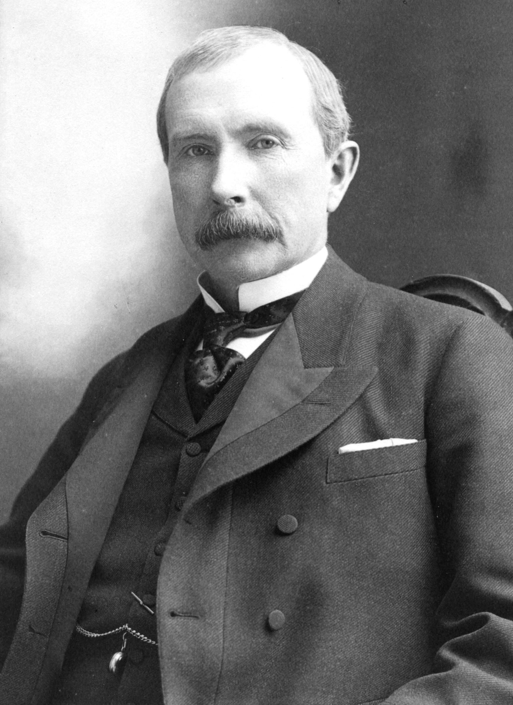{fig-alt="Studio portrait photograph of John D. Rockefeller, founder of Standard Oil, in a dark suit."}

<!-- alt candidates for rockefeller.jpg - edit the fig-alt= above by hand.
     [claude                ] Studio portrait photograph of John D. Rockefeller, founder of Standard Oil, in a dark suit.
     [sd-caption            ] Portrait of John D. Rockefeller, 1907
     [file-desc             ] Full HD portrait of 56-year-old John D. Rockefeller .
-->
<!-- ALT-BLOCK:END rockefeller.jpg -->

::: notes
Do the GDP math out loud, because it lands: Rockefeller at 2.3% of US GDP. US GDP in
2025 is roughly $30 trillion, so the same *share* today would be on the order of
$700 billion - well past any individual alive. Musk and Bezos are not historically
unprecedented; they are a *return* to something.

Morgan is the connective tissue to Part 1: he bankrolled Edison, then merged
Edison General Electric into **General Electric** in 1892. The man who financed the
War of the Currents also assembled U.S. Steel. Same guy. Same decade.

Verify-at-build: all three figures are from the linked Wikipedia articles; trace to
the cited biographies (Chernow on Rockefeller and Morgan; T.J. Stiles on Vanderbilt)
before asserting in print.
:::

## "Morganization"

Morgan's actual method, in three steps:

1. Find an industry full of competitors undercutting each other
2. Buy them, merge them, put your own directors on the board
3. Now there is one company, and it sets the price

Congress eventually went looking. The 1912 **[Pujo Committee](https://en.wikipedia.org/wiki/Pujo_Committee)** found that Morgan's bank and two allied banks together sat on boards controlling **\$22.2 billion** in resources.

They gave it a name: **the Money Trust.**

*This will be relevant for our discussion about who owns the grid, and later, who owns the data centers.*

::: notes
This slide is the hinge between "rich guys" and "political problem." The Pujo finding
is the moment the US government officially writes down that a handful of private
citizens control the economy.

Forward-reference deliberately: in Week 7 we will ask the identical question about
compute. Five companies own the models, the chips, and the data centers. The pattern
is not new; only the commodity changed.
:::

# Why Coal? Why There? {.divider}

## Coal is the thing that makes everything else possible

Electrification was not a *replacement* for coal. **Electrification was a coal delivery system.**

You cannot have:

- steel without **coke** (baked coal)
- railroads without steel and without coal in the firebox
- a Westinghouse AC generating station without **a boiler**, and a boiler without coal
- a lit city without a power plant, and in 1900 a power plant was a coal fire with extra steps

**Every argument in Part 1 was an argument about how to move heat from a burning rock.**

::: notes
This is the physics spine of the lecture and it is worth slowing down for. Tie it back
to Lecture 2: chemical energy -> thermal -> mechanical (turbine) -> electrical
(Faraday). The "current war" was a fight over the *last* arrow only. The first arrow
never changed, and it is still the first arrow for ~60% of world electricity today.

Good place to ask the class: "if the physics didn't change, what did the War of the
Currents actually decide?" (Answer: transmission distance - which decided *where the
coal could be* relative to *where the people were*. Which decided who got sacrificed.)
:::

## Anthracite: the good stuff

Pennsylvania's **[Coal Region](https://en.wikipedia.org/wiki/Coal_Region)** — Carbon, Lackawanna, Luzerne, Northumberland and Schuylkill counties — holds **the largest known anthracite deposits in the world**: roughly **7 billion short tons**.

Anthracite is the highest-carbon, hardest, cleanest-burning coal. It burns hot and nearly smokeless, which is exactly what you want in a city and in an iron furnace.

The **[Lehigh Valley](https://en.wikipedia.org/wiki/Lehigh_Valley)** is where that coal got out:

- **Lehigh Canal**, opened **1827** — coal to Philadelphia and New York
- **Lehigh Valley Railroad** (Asa Packer) — coal to everywhere else
- **Bethlehem Steel**, founded **1899** — the nation's #2 steelmaker, built on that coal

<!-- IMG: breaker_boys.jpg -->
<!-- ALT-BLOCK:BEGIN breaker_boys.jpg -->
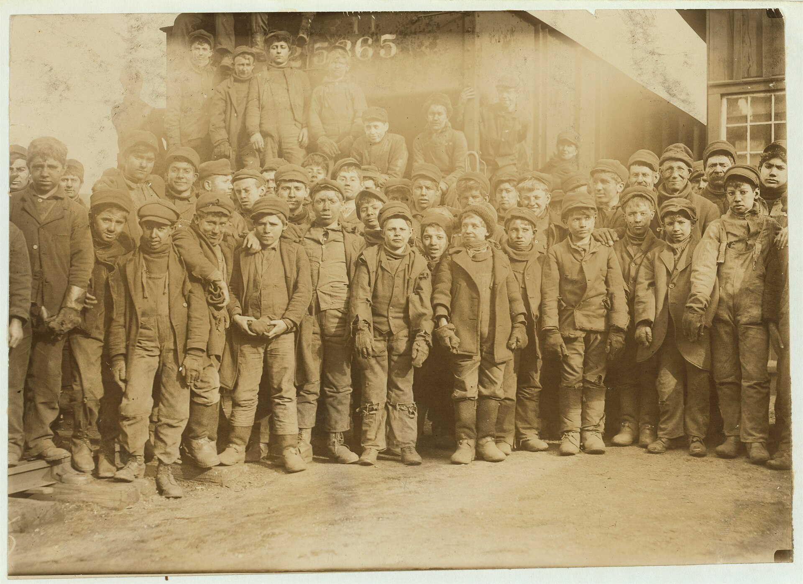{fig-alt="Sepia group portrait of several dozen coal workers posed outside a Pennsylvania coal breaker - many of them boys, standing among the adult men, all in work clothes and caps."}

<!-- alt candidates for breaker_boys.jpg - edit the fig-alt= above by hand.
     [claude                ] Lewis Hine photograph of dozens of soot-covered boys, many appearing under twelve years old, crouched in rows over coal chutes inside the Ewen Breaker, picking slate out of anthracite by hand in near-darkness.
     [file-desc             ] Title: Breaker boys working in Ewen Breaker of Pennsylvania Coal Co. For some of their names see labels 1927 to 1930. Abstract: Photographs from the records of the National Child Labor Committee (U.S.) Physical description: 1 photographic print. Notes: Boys.; Coal miners.
-->
<!-- ALT-BLOCK:END breaker_boys.jpg -->
<!-- IMG: lehigh_canal.jpg -->
<!-- ALT-BLOCK:BEGIN lehigh_canal.jpg -->
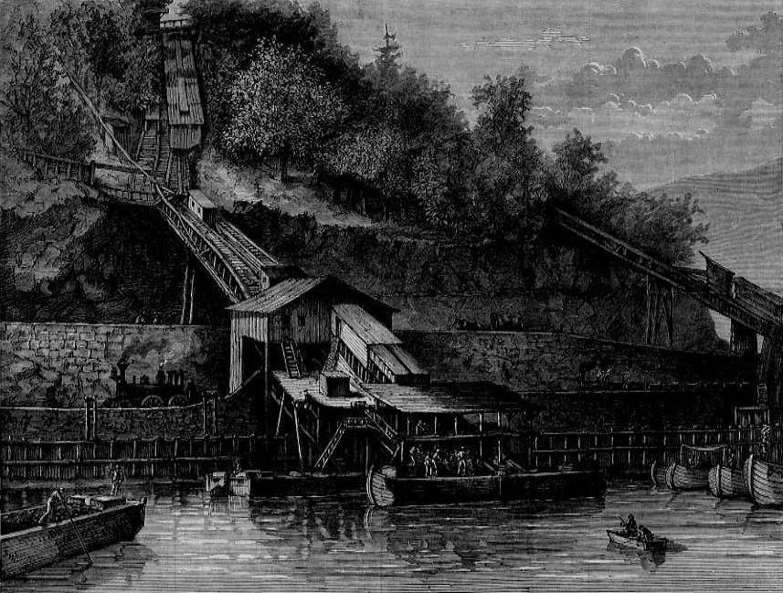{fig-alt="Nineteenth-century engraving of wooden chutes running down a wooded hillside to load anthracite into flat canal boats on the Lehigh Canal, with a boatman in the foreground."}

<!-- alt candidates for lehigh_canal.jpg - edit the fig-alt= above by hand.
     [claude                ] Historic photograph of coal chutes loading anthracite into flat canal boats on the Lehigh Canal, with a towpath and wooded hillside behind.
     [file-desc             ] Down Among the Coal Mines -- Chutes Loading the Canal-Boats on the Lehigh Canal , a wood engraving published in Harper's Weekly , February 1873. Anthracite Coal was loaded at the foot of Mount Pisgah from above historic Mauch Chunk (present-day Jim Thorpe, Pennsylvania ). At the top of the image ...
     [article-alt: Lehigh Canal] Woodcut of coal being loaded onto boats
-->
<!-- ALT-BLOCK:END lehigh_canal.jpg -->

::: notes
Geology as destiny. Anthracite is ~300-million-year-old Carboniferous swamp that got
buried deeper and squeezed harder than bituminous coal - more heat and pressure,
more carbon, fewer volatiles.

Note the ordering for students: the canal came *first* (1827), then rail, then steel.
Energy infrastructure precedes and determines industry location. That is a rule that
still holds - it is why data centers are being built next to Susquehanna and next to
hydro.

FIGURE TO ADD: Commons search "Lehigh Canal" or "Anthracite coal breaker Pennsylvania".
Alt text: "Black-and-white photograph of a tall wooden coal breaker building beside a
canal, with rail cars of coal in the foreground."
Check license individually - prefer PD pre-1930 photographs.
:::

## Who was there first

Before it was the Coal Region, the Susquehanna valley was the homeland of the **[Susquehannock](https://en.wikipedia.org/wiki/Susquehannock)** — an Iroquoian people whose name meant *"people of the muddy river."*

- ~**2,000** people in 1600; John Smith meets them in **1608**
- Smallpox (**1661**), then the Beaver Wars, then colonial militias. By 1671: **300** warriors left
- By 1763, **Conestoga Town** held **7 men, 5 women, 8 children**
- December 1763: the **Paxton Boys** murdered them all — six in the village, then the survivors in the Lancaster workhouse where they had been placed for protection

The language went extinct that December. About 100 words survive, written down by a Swedish missionary in the 1640s.

<!-- IMG: susquehannock.jpg -->
<!-- ALT-BLOCK:BEGIN susquehannock.jpg -->
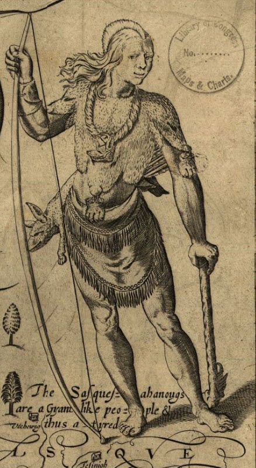{fig-alt="Engraved figure of a Susquehannock man from John Smith's 1624 map of Virginia, shown standing with a bow, a club and a quiver, wearing a fur robe."}

<!-- alt candidates for susquehannock.jpg - edit the fig-alt= above by hand.
     [manifest-note         ] The earliest European depiction; treat as a colonial representation, not a neutral record.
     [claude                ] Engraved figure of a Susquehannock man from John Smith's 1624 map of Virginia, shown standing with a bow, a club and a quiver, wearing a fur robe.
     [file-desc             ] This image of a Susquehannock was extracted from the 1624 Smith Map
-->
<!-- ALT-BLOCK:END susquehannock.jpg -->

::: notes
Do not skip this and do not soften it. The pattern of this entire course is:
(1) somebody already lived on the energy resource, (2) they were removed, (3) the
resource was extracted, (4) a new disposable workforce was imported to do the
extracting. The Coal Region ran that sequence a century before Blair Mountain, and
we will see it again with uranium and the Navajo in Week 5 and with cobalt in Week 6.

Note the specific brutality: they were murdered in protective custody, and nobody was
ever convicted. Benjamin Franklin wrote a furious pamphlet about it and it changed
nothing.

Connect forward to slide "Who dug it": the people who replaced them were also
disposable, just differently.
:::

## Who dug it, and where the wealth went

The Coal Region's workforce was imported in waves: **English, Welsh, Irish, German** first, then **Polish, Slovak, Ukrainian, Hungarian, Italian, Russian, Lithuanian and Jewish** immigrants.

The coal did not stay. It went to the **Steel Belt** — Pittsburgh, Cleveland, Detroit, Chicago, and **Buffalo** — where Appalachian coking coal met Minnesota iron ore over Great Lakes shipping.

**Buffalo's turn:** In 1899-1902 **Lackawanna Steel** moved from Scranton, in the Coal Region, to the Lake Erie shore south of Buffalo. Stated reasons included shipping costs — and **the fact that the UMW had organized Scranton in 1897 and struck successfully in 1900 and 1902.**

By the 1940s that plant employed **over 20,000 people.**

<!-- IMG: lackawanna_steel.jpg -->
<!-- ALT-BLOCK:BEGIN lackawanna_steel.jpg -->
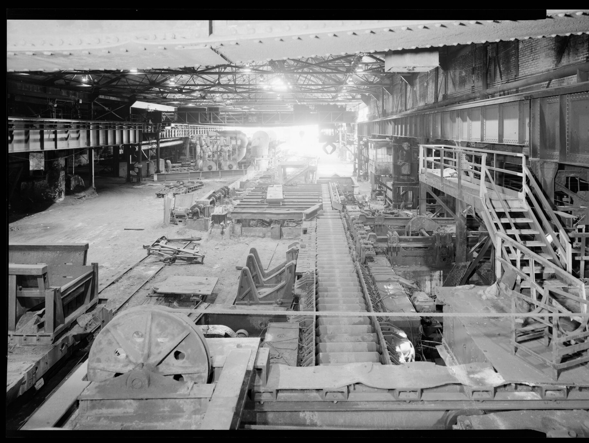{fig-alt="Large-format interior photograph of the Bethlehem Steel plant at Lackawanna, Buffalo: a long mill hall receding into the distance under overhead cranes, with rail track and machinery along its length."}

<!-- alt candidates for lackawanna_steel.jpg - edit the fig-alt= above by hand.
     [manifest-note         ] Source file is a .tif; the script downloads a scaled JPEG thumbnail, so the local name is .jpg.
     [claude                ] Large-format survey photograph of the Bethlehem Steel plant at Lackawanna on the Lake Erie shore south of Buffalo, showing mill buildings, stacks and rail lines.
-->
<!-- ALT-BLOCK:END lackawanna_steel.jpg -->

::: notes
[BUFFALO] This is the local hook and it is a sharp one: a steel company relocated
several hundred miles, in part, to get away from a union. Lackawanna, NY is named
after Lackawanna, PA - the company brought the name with it. About 2,000 workers
moved with it; ~6,000 were employed by 1903.

Bethlehem Steel bought Lackawanna Steel in 1922. The plant is gone now. Students from
Lackawanna will know the site; the Bethlehem Steel remnants and the wind turbines now
standing on that brownfield are a nice visual.

Also note Lackawanna Iron & Steel started building its own company town in 1901 -
it "lacked most services" and "the housing stood empty for many years." Buffalo has
its own small company-town story. Section 4 will pick this up.

FIGURE TO ADD: Commons "Lackawanna Steel" or "Bethlehem Steel Lackawanna".
Alt text: "Aerial or ground photograph of a sprawling steel mill complex with
smokestacks on the Lake Erie shoreline."
:::

# The Shooting War {.divider}

## 1890-1930: the Coal Wars

We call them "labor disputes." They were **[armed conflicts](https://en.wikipedia.org/wiki/Coal_Wars)**, roughly 1890-1930, and they have a body count.

| Year | Event | What happened |
|---|---|---|
| 1894 | Cripple Creek strike (CO) | Miners vs. hired deputies |
| 1902 | **Anthracite strike** (PA) | 150,000+ out for 163 days |
| 1912-13 | Paint Creek-Cabin Creek (WV) | Mine guards, an armored train, martial law |
| **1914** | **[Ludlow Massacre](https://en.wikipedia.org/wiki/Ludlow_Massacre)** (CO) | **~19-25 dead, including 12 children** |
| 1920 | **Matewan Massacre** (WV) | 10 dead in a 15-second gunfight |
| **1921** | **Battle of Blair Mountain** (WV) | **~10,000 armed miners** |
| 1931-39 | Harlan County War (KY) | "Bloody Harlan" |

The private army in most of these is the same one: the **Baldwin-Felts Detective Agency.**

<!-- IMG: ludlow_ruins.jpg -->
<!-- ALT-BLOCK:BEGIN ludlow_ruins.jpg -->
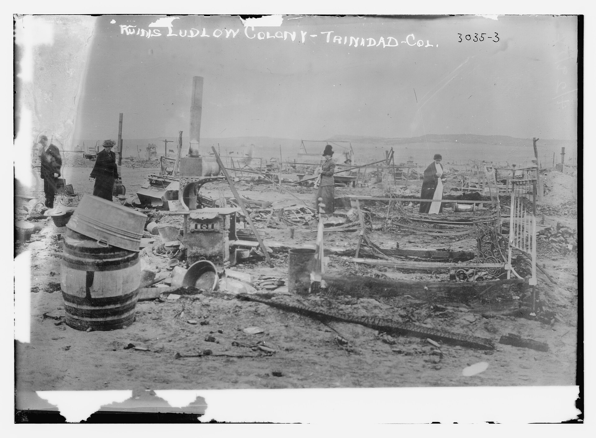{fig-alt="Photograph of the burned-out Ludlow tent colony in Colorado after the April 1914 attack: charred ground, twisted iron bedsteads and collapsed tent frames, with people standing among the wreckage."}

<!-- alt candidates for ludlow_ruins.jpg - edit the fig-alt= above by hand.
     [claude                ] Photograph of the burned-out Ludlow tent colony in Colorado after the April 1914 attack: charred ground, twisted iron bedsteads and collapsed tent frames, with people standing among the wreckage.
     [file-desc             ] Title: Ruins Ludlow Colony -- Trinidad, Col. Abstract/medium: 1 negative : glass ; 5 x 7 in. or smaller. Per LOC: Photo shows ruins in the aftermath of the Ludlow Massacre, during which a tent camp of striking miners at Ludlow, Colorado was attacked by the Colorado National Guard on April 20, 191...
-->
<!-- ALT-BLOCK:END ludlow_ruins.jpg -->

::: notes
Read the Ludlow line slowly. 20 April 1914: Colorado National Guard and Baldwin-Felts
guards attacked a tent colony of evicted strikers the day after Orthodox Easter. Four
women and eleven children hid in a pit under a tent; the tent was set on fire above
them. Two women and all eleven children suffocated. The mine was Colorado Fuel & Iron -
controlled by **John D. Rockefeller Jr.** Twenty-two guardsmen were court-martialed.
All were acquitted.

That is the same Rockefeller name from the table two sections ago. This is the payoff
of having introduced them: these are not separate stories.

Source care: Ludlow's death toll is reported as ~19-25 by modern historians; some
contemporary accounts claimed 55. Use the range.
:::

## What the fight was actually about

Not wages, primarily. **The right to have a union at all.**

To get there miners had to get past:

- **Yellow-dog contracts** — sign away your right to join a union as a condition of employment
- **Mine guards** — Baldwin-Felts agents, paid by the operators, deputized by the county
- **Eviction** — you live in the company's house, so a strike makes you homeless the same week
- **Scrip** — you are paid in the company's private money, which is worth face value *only at the company store*

A miner in 1921 put it plainly: after loading car after car of coal, you still "couldn't come out to the company store and get enough food to feed your family."

::: notes
Set up Section 4 here - scrip and eviction get their own slides. The key idea to plant
now: the company was simultaneously your employer, your landlord, your grocer, your
bank, your police force, and in many counties your judge. There is no part of your
life that striking does not put at risk. That is the design.

Ask the class: "what would it take for you to go on strike under those conditions?"
Then tell them 10,000 people did.
:::

## 19 May 1920 -> 1 Aug 1921: the fuse

**Matewan, WV, 19 May 1920.** Baldwin-Felts agents come to evict miners' families. Police chief **Sid Hatfield** and Mayor Cabell Testerman confront them. Fifteen seconds of shooting: **ten dead**, including the mayor and Albert Felts.

Hatfield becomes a folk hero. He is tried for murder in January 1921 — **and acquitted.**

**1 August 1921.** Hatfield walks up the courthouse steps in Welch, McDowell County, unarmed, with his wife on his arm. Baldwin-Felts agents shoot him and his friend Ed Chambers dead on the steps.

**Nobody is ever convicted.**

Two weeks later, ten thousand miners pick up rifles.

<!-- IMG: sid_hatfield.jpg -->
<!-- ALT-BLOCK:BEGIN sid_hatfield.jpg -->
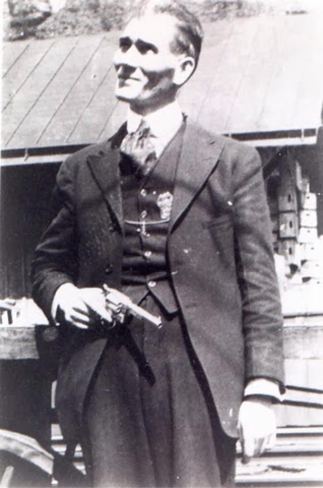{fig-alt="Portrait photograph of Sid Hatfield, chief of police of Matewan, West Virginia, in a suit and tie around 1920."}

<!-- alt candidates for sid_hatfield.jpg - edit the fig-alt= above by hand.
     [claude                ] Portrait photograph of Sid Hatfield, chief of police of Matewan, West Virginia, in a suit and tie around 1920.
     [sd-caption            ] Sid Hatfield c. 1920
     [file-desc             ] Former sheriff Sid Hatfield c. 1920
-->
<!-- ALT-BLOCK:END sid_hatfield.jpg -->
<!-- IMG: mother_jones.jpg -->
<!-- ALT-BLOCK:BEGIN mother_jones.jpg -->
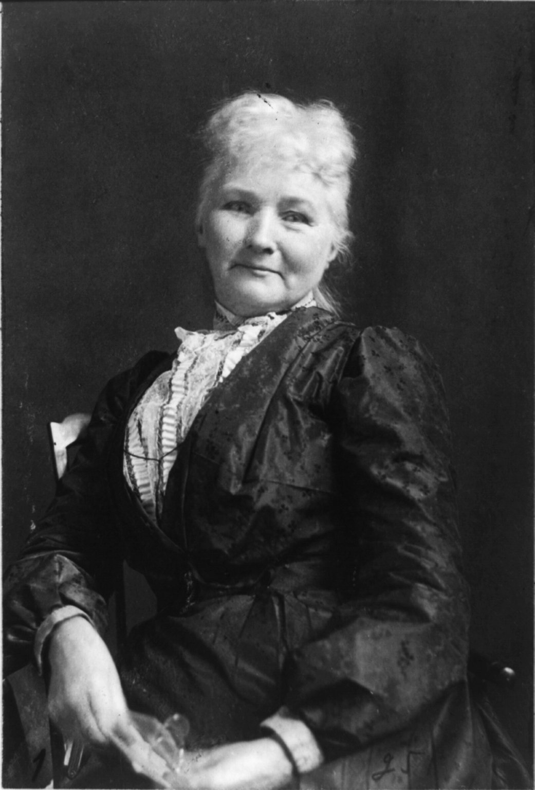{fig-alt="Portrait photograph of labour organiser Mary Harris 'Mother' Jones, an elderly white-haired woman in a dark high-collared dress and wire-rimmed glasses."}

<!-- alt candidates for mother_jones.jpg - edit the fig-alt= above by hand.
     [claude                ] Portrait photograph of labour organiser Mary Harris 'Mother' Jones, an elderly white-haired woman in a dark high-collared dress and wire-rimmed glasses.
     [sd-caption            ] Mother Jones in 1902 at age 65.
     [file-desc             ] Mother Jones , American labor activist.
-->
<!-- ALT-BLOCK:END mother_jones.jpg -->
<!-- IMG: union_leaders.jpg -->
<!-- ALT-BLOCK:BEGIN union_leaders.jpg -->
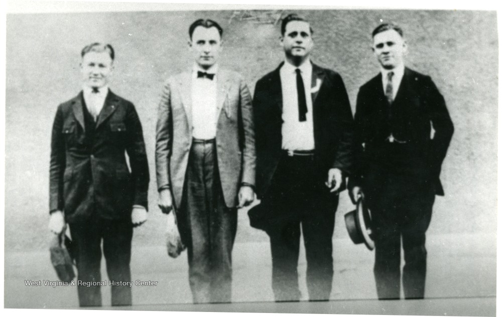{fig-alt="Group photograph of United Mine Workers leaders during the 1921 armed march in the southern West Virginia coalfields, men in suits and hats standing together."}

<!-- alt candidates for union_leaders.jpg - edit the fig-alt= above by hand.
     [claude                ] Group photograph of United Mine Workers leaders during the 1921 armed march in the southern West Virginia coalfields, men in suits and hats standing together.
     [file-desc             ] Leaders of the Union During the Armed March in West Virginia Southern Coal Fields. L to R - Bill Blizzard, Fred Mooney, William Petry, and Frank Keeney were the leaders of the Coal Miners Union during the Mine Wars in southern West Virginia.
-->
<!-- ALT-BLOCK:END union_leaders.jpg -->

::: notes
This is the emotional pivot of the deck. Slow down. The detail that does the work is
"on the courthouse steps, in front of his wife, unarmed, and nobody was charged."
Miners concluded, correctly, that the law was not available to them.

[MOTIF] If using Hunger Games: this is the whipping in the square. The system
demonstrates that its rules do not apply to itself, and that is what starts the
rebellion - not poverty, which they had already endured for thirty years.

John Sayles' film **Matewan** (1987) dramatizes the massacre and is genuinely good;
Chris Cooper and James Earl Jones. Worth a clip if you have two minutes.
:::

## 25 Aug - 2 Sep 1921: Blair Mountain

**~10,000 miners** marched on Logan County. Against them: **~3,000 "Logan Defenders"** under Sheriff **Don Chafin**, paid by the Logan County Coal Operators Association, plus state police.

Five days of fighting along a mountain ridge. Roughly **one million rounds** fired. Machine guns on both sides.

**Private planes, hired by Chafin, dropped homemade bombs on American citizens.** Army bombers flew surveillance under Gen. Billy Mitchell.

It ended on **2 September** when federal troops arrived — **because the miners would not shoot at US soldiers.** Many of them had been US soldiers three years earlier.

> **Casualty figures are genuinely contested.** Wikipedia gives 50-100 miners killed; the West Virginia Mine Wars Museum documents ~16 confirmed miner deaths. Nobody counted carefully. *That uncertainty is itself a finding.*

<!-- IMG: blair_map.png -->
<!-- ALT-BLOCK:BEGIN blair_map.png -->
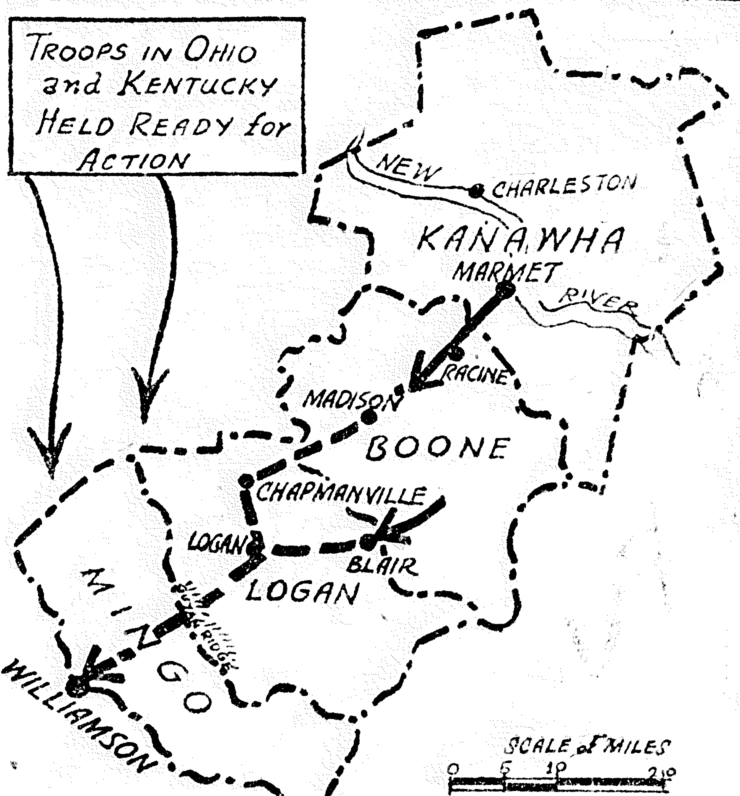{fig-alt="Hand-drawn map of southern West Virginia marking Charleston, Marmet, Madison, Logan, Blair and Williamson, with arrows showing the movement of the union miners and a note reading 'Troops in Ohio and Kentucky held ready for action'."}

<!-- alt candidates for blair_map.png - edit the fig-alt= above by hand.
     [claude                ] Map of southern West Virginia showing arrows tracing the route of the union miners' armed march from Lens Creek toward Logan County and the Blair Mountain ridge in August 1921.
     [file-desc             ] Map of the movement of the union miners from Marmet to Williamson during the Battle of Blair Mountain in 1921.
-->
<!-- ALT-BLOCK:END blair_map.png -->
<!-- IMG: blair_machine_gun.jpg -->
<!-- ALT-BLOCK:BEGIN blair_machine_gun.jpg -->
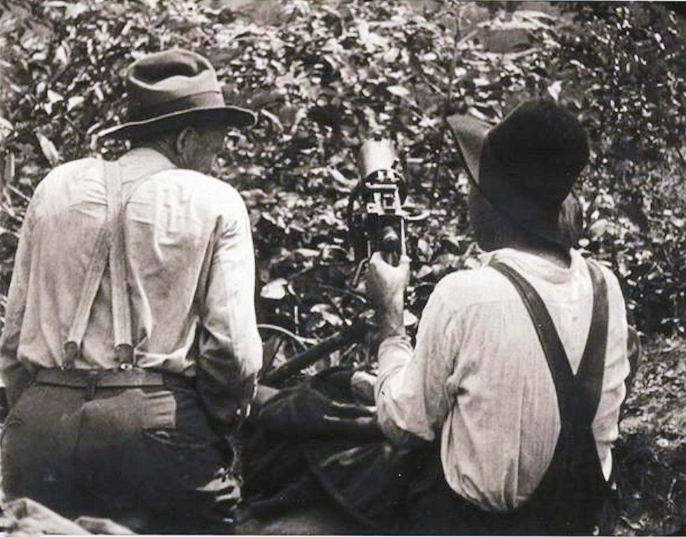{fig-alt="Photograph of a machine-gun emplacement on a wooded ridge at Blair Mountain in 1921, with men in shirtsleeves and hats positioned behind the gun."}

<!-- alt candidates for blair_machine_gun.jpg - edit the fig-alt= above by hand.
     [claude                ] Photograph of a machine-gun emplacement on a wooded ridge at Blair Mountain in 1921, with men in shirtsleeves and hats positioned behind the gun.
     [file-desc             ] Two non-uniformed individuals man an elevated M1917A1 Machine gun position during the Battle of Blair Mountain in 1921.
-->
<!-- ALT-BLOCK:END blair_machine_gun.jpg -->
<!-- IMG: blair_miner.jpg -->
<!-- ALT-BLOCK:BEGIN blair_miner.jpg -->
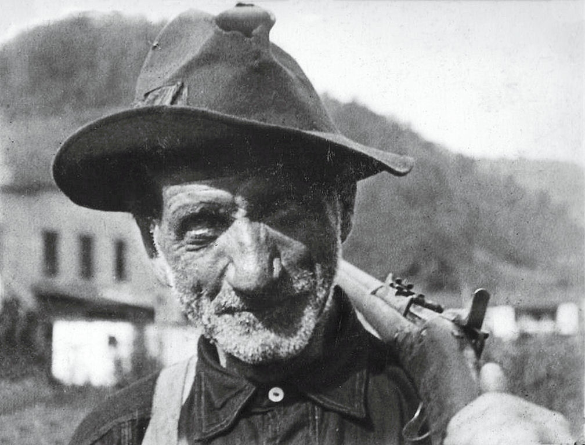{fig-alt="Photograph of an armed coal miner in work clothes and a hat during the 1921 Blair Mountain conflict, rifle in hand, a cloth tied around his neck."}

<!-- alt candidates for blair_miner.jpg - edit the fig-alt= above by hand.
     [manifest-note         ] Check whether the neckerchief is visible - it is the red-bandana 'redneck' detail.
     [claude                ] Photograph of an armed coal miner in work clothes and a hat during the 1921 Blair Mountain conflict, rifle in hand, a cloth tied around his neck.
     [file-desc             ] After the Battle of Blair Mountain in 1921 the union miners surrendered to the federal troops and gave them their weapons. Coal miner stands with his rifle over his soldier.
-->
<!-- ALT-BLOCK:END blair_miner.jpg -->
<!-- IMG: airfleet.png -->
<!-- ALT-BLOCK:BEGIN airfleet.png -->
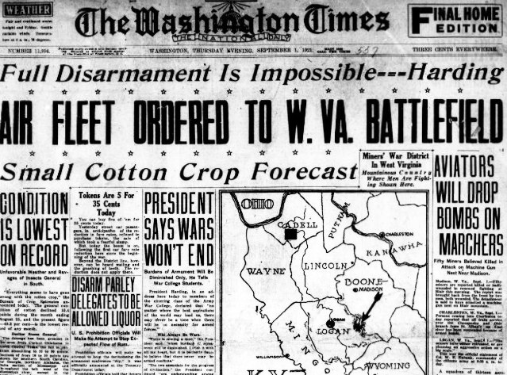{fig-alt="Front page of The Washington Times, 1921, under the banner headline 'AIR FLEET ORDERED TO W. VA. BATTLEFIELD', with a sub-headline reading 'Aviators will drop bombs on marchers', above a map of the West Virginia coalfields."}

<!-- alt candidates for airfleet.png - edit the fig-alt= above by hand.
     [claude                ] Period newspaper photograph of the Army air fleet ordered to West Virginia during the Battle of Blair Mountain in 1921, showing biplanes lined up on a field.
     [file-desc             ] Cover of the Washington Times which has the headline 'Airfleet Ordered to W. Va. Battlefield'. The cover of the newspapers shows a large headline that the airfleet has been sent into West Virginia to get control over the fighting miners during the Battle of Blair Mountain in 1921.
-->
<!-- ALT-BLOCK:END airfleet.png -->

::: notes
[RESEARCH SKILL TIE-IN] Use the casualty disagreement deliberately - it is the best
teaching moment in the deck for the note-taking/research thread. Ask: why would the
number be unknown? Who would have had to count? Who had an interest in the number
being small, or large? What would count as a primary source here? (Answer: coroner's
records, which for Logan County are incomplete; UMW Journal reporting, which is
partisan; the 985 indictments, which are a hard number precisely because the state
generated them.)

The miners wore **red bandanas** around their necks to identify each other. Their
opponents wore white armbands and called them **"rednecks."** That is one credible
origin of the word, per the WV Mine Wars Museum - flag it as *one* account, not settled
etymology, because the word has older uses.

The miners' army was **Black, white, and immigrant together** - "a darn solid mass of
different colors and tribes blended together" (Fred Ball, United Mine Workers Journal).
Matewan in 1921 was one of very few US towns where Black and white children attended
school together. Chuck Keeney: Black and white miners held cafeteria workers at
gunpoint until everyone was served in the same room. In 1921. In the South.
Hold that fact for the Klan slide in Section 5.

FIGURE TO ADD: Commons "Battle of Blair Mountain" - PD photos of armed miners and of
federal troops exist. Check each individually; some WV Archives images are not free.
Alt text: "Group photograph of armed coal miners in work clothes, several wearing
bandanas around their necks, standing on a hillside."
:::

## The oligarchy won

Let us be completely clear about the outcome.

- **985 miners indicted** — murder, conspiracy, and **treason against the State of West Virginia**
- **UMWA membership in the region collapsed from 50,000+ to about 10,000**
- **80% of mines reopened** with replacement workers and yellow-dog contracts
- **Union organizing in southern West Virginia was dead until 1933**
- **Nobody was ever punished for killing Sid Hatfield.** Nobody was punished for Ludlow either.

The operators kept the coal, kept the towns, kept the money, and kept the courts.

**The people who committed the atrocities got richer. That is the actual ending.**

<!-- IMG: miners_with_bomb.jpg -->
<!-- ALT-BLOCK:BEGIN miners_with_bomb.jpg -->
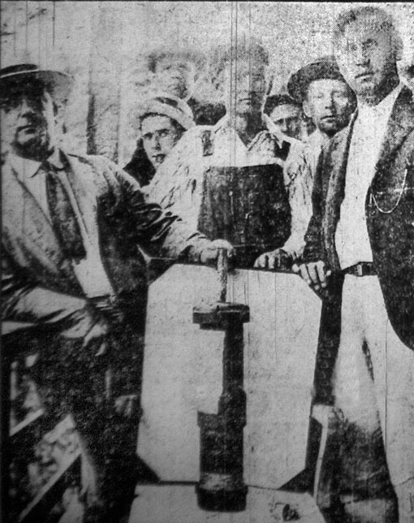{fig-alt="Photograph of coal miners holding up an unexploded homemade bomb that was dropped on them from an aircraft during the Battle of Blair Mountain."}

<!-- alt candidates for miners_with_bomb.jpg - edit the fig-alt= above by hand.
     [claude                ] Photograph of coal miners holding up an unexploded homemade bomb that was dropped on them from an aircraft during the Battle of Blair Mountain.
     [file-desc             ] UMW officials and members of the 'miner's army' display a bomb dropped on them during the Battle of Blair Mountain
-->
<!-- ALT-BLOCK:END miners_with_bomb.jpg -->
<!-- IMG: bill_blizzard.jpg -->
<!-- ALT-BLOCK:BEGIN bill_blizzard.jpg -->
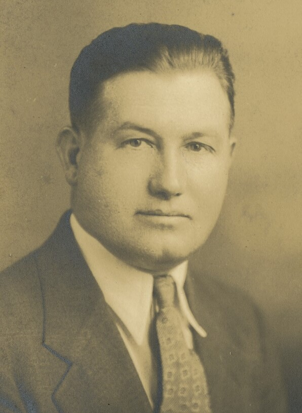{fig-alt="Portrait photograph of union leader Bill Blizzard, who led the miners at Blair Mountain and was acquitted of treason against West Virginia."}

<!-- alt candidates for bill_blizzard.jpg - edit the fig-alt= above by hand.
     [claude                ] Portrait photograph of union leader Bill Blizzard, who led the miners at Blair Mountain and was acquitted of treason against West Virginia.
     [file-desc             ] Bill Blizzard (1892-1958) circa 1920
-->
<!-- ALT-BLOCK:END bill_blizzard.jpg -->

::: notes
Resist the urge to redeem this slide. Students expect a triumphant labor story and
this is not one. The honest version: organized workers lost, badly, for twelve years,
and the thing that eventually changed it was federal law (NIRA, 1933) plus the
Depression - not the courage of the miners alone. Courage was necessary and it was
not sufficient.

Bill Blizzard was acquitted of treason. His defense exhibit was an unexploded bomb
dropped on the miners from an aircraft, recovered from the battlefield.

Then pivot: so if losing a shooting war didn't change it, what *did* start to?
-> the political movement. Next slide.
:::

## The reformer, and his asterisks

The backlash against the trusts produced **[Theodore Roosevelt](https://en.wikipedia.org/wiki/Theodore_Roosevelt)** — and he became president **in Buffalo.**

**[Pan-American Exposition](https://en.wikipedia.org/wiki/Pan-American_Exposition)**, Buffalo, 1901: 8 million visitors, lit at night by **AC power transmitted 25 miles from Niagara Falls.** *The War of the Currents, settled, as set dressing.* They called it the Rainbow City.

**6 Sept 1901:** McKinley shot there. **14 Sept 1901:** he dies; Roosevelt takes the oath in a Buffalo parlor.

**1902:** Roosevelt intervenes in the anthracite strike — the first president ever to mediate a labor dispute rather than send troops to break it. He threatened to have the Army *seize and run the mines.* Morgan brokered the deal. Miners got **10%** (they asked 20) and a **9-hour day** (they asked 8), and **no union recognition.**

He filed **44 antitrust suits** — his three predecessors filed 18 between them.

<!-- IMG: panam_electric_tower.jpg -->
<!-- ALT-BLOCK:BEGIN panam_electric_tower.jpg -->
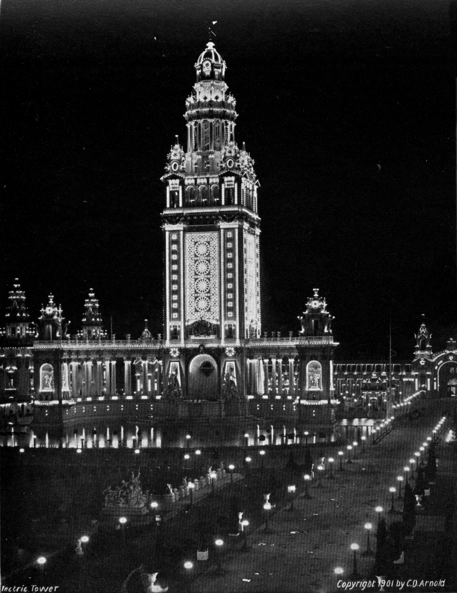{fig-alt="Night view of the Electric Tower at the 1901 Pan-American Exposition in Buffalo, its outline picked out by thousands of incandescent bulbs powered by alternating current from Niagara Falls, reflected in the water below."}

<!-- alt candidates for panam_electric_tower.jpg - edit the fig-alt= above by hand.
     [claude                ] Night view of the Electric Tower at the 1901 Pan-American Exposition in Buffalo, its outline picked out by thousands of incandescent bulbs powered by alternating current from Niagara Falls, reflected in the water below.
     [file-desc             ] Original caption: 'Electric Tower at Night - The illumination of the Electric Tower, the most marvelous achievement of the age of its kind, is effected by the use of about 40,000 incandescent electric lamps, so arranged both without and within the Tower that a great variety of effects can be secu...
-->
<!-- ALT-BLOCK:END panam_electric_tower.jpg -->
<!-- IMG: teddy_roosevelt.jpg -->
<!-- ALT-BLOCK:BEGIN teddy_roosevelt.jpg -->
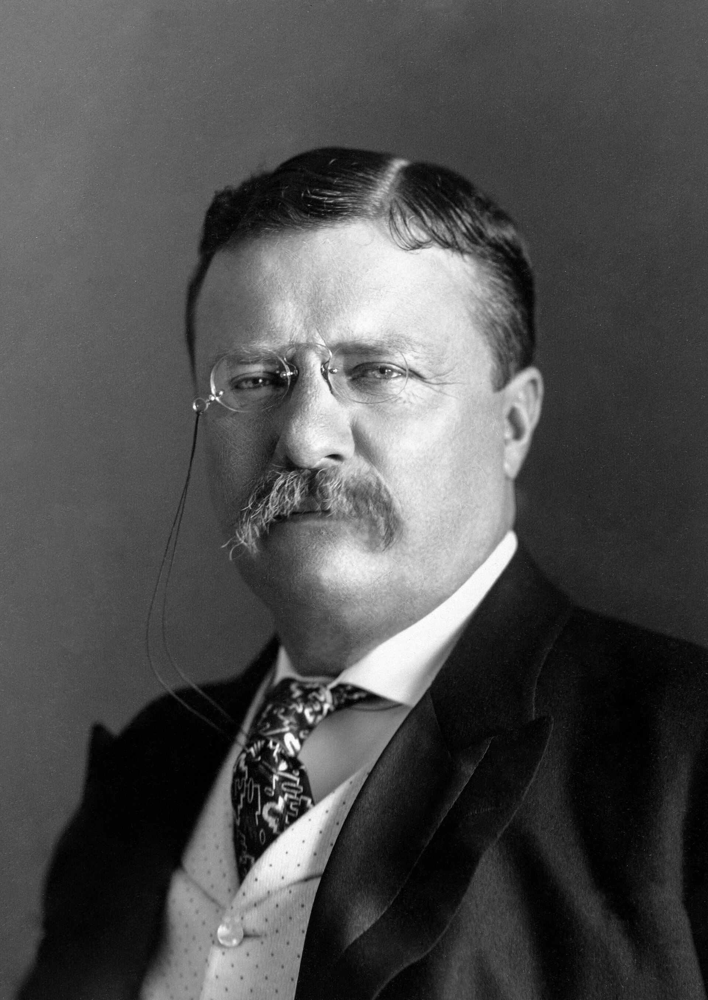{fig-alt="Formal portrait photograph of President Theodore Roosevelt in a dark suit, seated, by the Pach Brothers studio."}

<!-- alt candidates for teddy_roosevelt.jpg - edit the fig-alt= above by hand.
     [claude                ] Formal portrait photograph of President Theodore Roosevelt in a dark suit, seated, by the Pach Brothers studio.
     [sd-caption            ] Theodore Roosevelt as President of the United States
     [file-desc             ] Photograph showing head and shoulders, facing slightly left. Artificially desaturated from a sepia original
-->
<!-- ALT-BLOCK:END teddy_roosevelt.jpg -->

::: notes
[BUFFALO] Lean all the way into this. Stand in the Wilcox Mansion in your mind: the
trust-buster is sworn in, three miles from a fairground running on Niagara alternating
current, one year before he forces J.P. Morgan to the table over coal. Everything in
this lecture intersects in Buffalo in 1901.

The coal operators' spokesman, **George Baer**, wrote during the 1902 strike that
workers would be protected "not by the labor agitators, but by the Christian men to
whom God in His infinite wisdom has given control of the property interests of this
country." They actually said the quiet part. Read it aloud; it is the single best
primary-source quote in the lecture.

Note what the miners did NOT get in 1902: recognition. That is why 1921 happened.
:::

## Same man: San Juan Hill

Roosevelt is not a hero of this course. He is a useful, complicated hinge.

- **1898:** resigns from the Navy Department to raise the **[Rough Riders](https://en.wikipedia.org/wiki/Rough_Riders)**; charges Kettle and San Juan Hills in **Cuba**. He called it "the great day of my life." The assaults cost roughly 200 killed and 1,000 wounded.
- **1900:** argues for keeping **the Philippines** permanently. The Philippine-American War killed hundreds of thousands of Filipinos.
- **1904:** the **Roosevelt Corollary** — the US claims the right to intervene anywhere in the hemisphere against "chronic wrongdoing." He applied "survival of the fittest" to *nations.*
- **1901:** invites **Booker T. Washington** to dine at the White House, then never does it again after the Southern backlash.

**The same politics that restrained monopoly at home justified empire abroad.** Both rest on deciding who counts.

<!-- IMG: rough_riders.jpg -->
<!-- ALT-BLOCK:BEGIN rough_riders.jpg -->
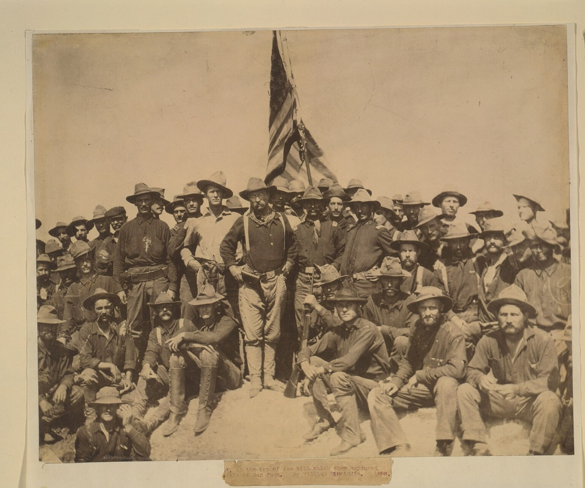{fig-alt="1898 photograph by William Dinwiddie of Colonel Theodore Roosevelt standing among the Rough Riders and other US troops on a captured hilltop in Cuba, an American flag raised behind them."}

<!-- alt candidates for rough_riders.jpg - edit the fig-alt= above by hand.
     [claude                ] 1898 photograph by William Dinwiddie of Colonel Theodore Roosevelt standing among the Rough Riders and other US troops on a captured hilltop in Cuba, an American flag behind them.
     [file-desc             ] Title: Colonel Roosevelt and his Rough Riders at the top of the hill which they captured, Battle of San Juan] / by William Dinwiddie Abstract/medium: 1 photographic print : albumen.
-->
<!-- ALT-BLOCK:END rough_riders.jpg -->

::: notes
This slide is the course's ethical throughline in miniature and it matters that it
comes immediately after the admiring slide. Do not let students file TR as "good guy."
The conservation record is real (230 million acres protected). The antitrust record is
real. The imperialism is also real, and the Filipinos on the receiving end of it were
having the Blair Mountain experience at national scale.

Useful framing question: "Progressivism protected some people from concentrated power
by expanding the power of the state. Who did the state then point at?"

Connect forward: the same question returns in Week 5 (Hiroshima; uranium and the
Navajo) and Week 6 (cobalt, rare earths). Energy empires need somewhere to put the cost.

IMAGE CAUTION: TR portraits and Rough Riders photos from 1898 are PD, but verify each
file; some Wikipedia TR images are non-free modern reproductions.
:::

# The Company Town {.divider}

## You rent your life from your boss

A **[company town](https://en.wikipedia.org/wiki/Company_town)** is a settlement where one company owns the housing, the store, the school, the church, and the job.

At their peak: **more than 2,500** company towns in the US, housing **about 3%** of the population. A **1916** Bureau of Labor Statistics survey of manufacturing and mining firms found **34.4%** of their workforce living in company housing.

The company called this **paternalism** and considered it a moral duty. One federal commission, investigating the **Pullman** strike of **1894**, called it something else:

> "The aesthetic features are admired by visitors, but have little money value to employees, especially when they lack bread."

The commission's verdict on Pullman's paternalism: **"Un-American."** Illinois sued, and in **1898** the state Supreme Court forced Pullman to sell the town.

<!-- IMG: pullman.jpg -->
<!-- ALT-BLOCK:BEGIN pullman.jpg -->
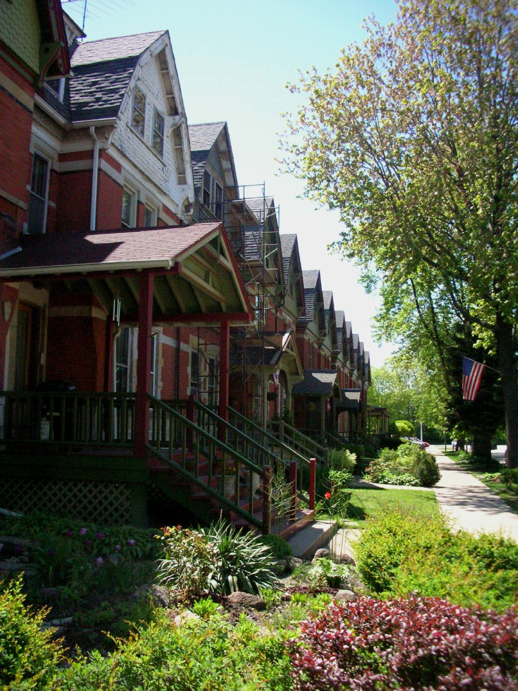{fig-alt="Colour photograph of a row of surviving Pullman company rowhouses on 112th Street in Chicago today, their brick and timber fronts painted in different colours, with small front gardens."}

<!-- alt candidates for pullman.jpg - edit the fig-alt= above by hand.
     [manifest-note         ] CC BY 2.0 - attribution MUST appear on the slide. The script will record the photographer's name in CREDITS.md; copy it into the caption.
     [claude                ] Photograph of a row of identical brick worker houses built by the Pullman Company on 112th Street in the Pullman district of Chicago.
     [file-desc             ] 'Instead of locating his factory for building railroad sleeping cars in Chicago, George M. Pullman built a town of his own outside the city limits — the first model, planned industrial community in the United States. Pullman contained everything necessary for a self- sustaining town: civic, publi...
-->
<!-- ALT-BLOCK:END pullman.jpg -->
<!-- IMG: company_store.jpg -->
<!-- ALT-BLOCK:BEGIN company_store.jpg -->
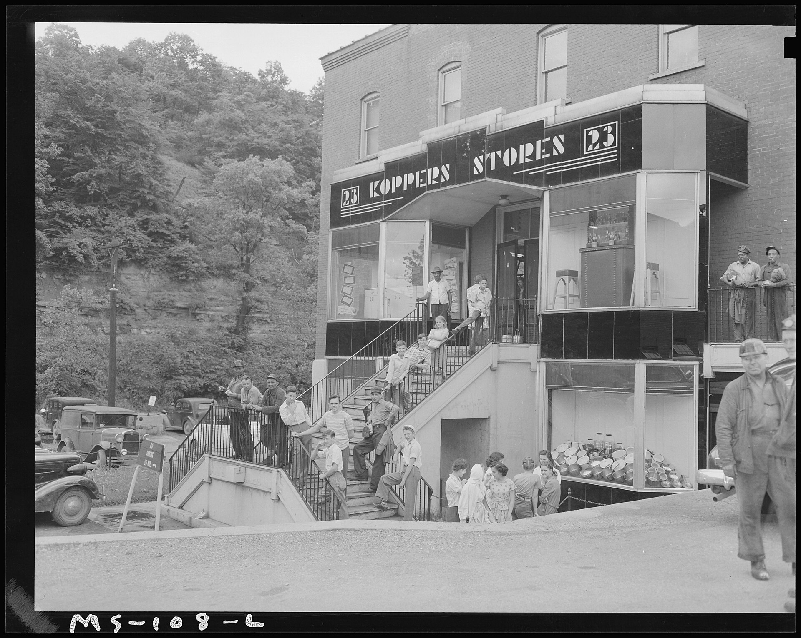{fig-alt="Photograph of the company store at the Koppers Coal Division Federal No. 1 Mine in Grant Town, West Virginia: a large building with the company name across the front and miners' cars parked outside."}

<!-- alt candidates for company_store.jpg - edit the fig-alt= above by hand.
     [claude                ] Photograph of the company store at the Koppers Coal Division Federal No. 1 Mine in Grant Town, West Virginia: a large building with the company name across the front and miners' cars parked outside.
-->
<!-- ALT-BLOCK:END company_store.jpg -->

::: notes
George Pullman built his town outside Chicago in the 1880s for 6,000 employees and
6,000 dependents. After the Panic of 1893 he cut wages but **did not cut rents or
store prices** - because those were separate business lines. That is the whole logic
of the company town exposed in one decision: your wage is a cost to be minimized, and
your rent is revenue to be maximized, and you are the same person.

Note the date: 1898, Illinois breaks up Pullman. 1921, Blair Mountain. The legal
precedent existed and it did not reach West Virginia for another generation.
:::

## Scrip: private money

Miners were often paid in **scrip** — metal or paper tokens issued by the coal company.

- Worth **full face value only at the company store**
- Companies **refused to redeem it for cash**
- Independent traders bought it at a discount of **25% and up**; nearby stores took it at **10-30% off**
- So taking your pay somewhere else meant taking a pay cut of up to a quarter

West Virginia passed a law against scrip-as-wages in **1891** and made scrip non-transferable in **1925**. It survived anyway until the coal industry itself collapsed in the **1950s**.

The operators' defense: scrip "educated miners to sound credit practices." A 1925 investigation concluded it did the opposite.

**"I owe my soul to the company store"** is not a metaphor. It is a description of a currency system.

<!-- IMG: coal_scrip.jpg -->
<!-- ALT-BLOCK:BEGIN coal_scrip.jpg -->
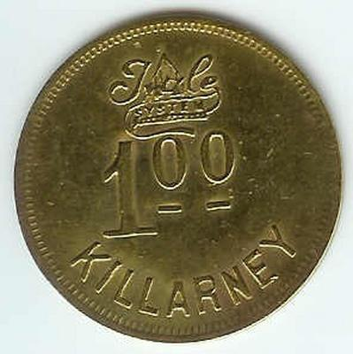{fig-alt="Close-up photograph of a metal coal-company scrip token stamped with the mine's name and a denomination, the private currency redeemable at face value only in the company store."}

<!-- alt candidates for coal_scrip.jpg - edit the fig-alt= above by hand.
     [claude                ] Close-up photograph of a metal coal-company scrip token stamped with the mine's name and a denomination, the private currency redeemable at face value only in the company store.
     [file-desc             ] Coal scrip from Killarney West Virginia
-->
<!-- ALT-BLOCK:END coal_scrip.jpg -->

::: notes
Worked number for the class - this is our simple calculation for the day:

  Suppose you earn $5.00/day in scrip, and the nearest independent store takes it at
  a 25% discount. Your real wage, if you shop anywhere but the company store, is
  $3.75/day. That is a **25% pay cut for the crime of shopping around.**
  Over a 300-day working year: $1,500 nominal, $1,125 real. **$375/yr taken.**
  In 1921 dollars, $375 is roughly three months of a miner's earnings.

  Alternatively the company store simply charges more. Either way the money comes back.

Economists do debate how coercive scrip was in practice (see Fishback's work in the
*Journal of Economic History*, "Did Coal Miners 'Owe Their Souls to the Company
Store'?"). Honest framing: the discount is documented; the argument is about how much
choice miners actually had. In isolated single-road hollows, not much.

Show a scrip token if you can find one - they are beautiful objects and genuinely
shocking when students realize it's a company minting its own coinage.
FIGURE TO ADD: Commons "coal scrip" / "company scrip token". Verify license.
Alt text: "A small metal token stamped with a coal company's name and a value of
one dollar, used as private currency in a company store."
:::

## 2025: Starbase, Texas

On **3 May 2025**, the residents of Boca Chica, Texas voted to incorporate as a city called **[Starbase](https://en.wikipedia.org/wiki/Starbase,_Texas)**.

- **212 for, 6 against.** 283 registered voters, 77% turnout
- Population just over 500 — **about 260 of them SpaceX employees**
- Mayor: **Bobby Peden, a SpaceX vice-president.** He ran unopposed. So did both commissioners, both with SpaceX ties
- SpaceX owns large tracts of the land; ~7,133 more acres slated for annexation

**June 2025:** the Texas Legislature passed **HB 5246**, moving authority to close **Boca Chica Beach and State Highway 4** from Cameron County to the new city's commissioners.

A public beach. Closed at the discretion of officials who work for the company.

::: notes
The company-town checklist, 1921 vs 2025: one employer (yes), company-owned housing
(yes), company-selected local government (yes), company control over public access and
movement (yes, as of HB 5246). What is missing is scrip - and note that the crypto
wing of this movement is explicitly interested in that.

Rep. Trey Martinez Fischer on the beach bill: *"The question is who gets to make the
call...? I submit to you it's not the people in the company town."*

Opposition is led by the **Carrizo/Comecrudo Tribe of Texas**, the South Texas
Environmental Justice Network, and Save RGV. Note who is objecting: an Indigenous
nation whose ancestral land this is. That is the Susquehannock slide again, 262 years
later, and it is worth saying so out loud.

Be fair and precise: Boca Chica Village residents were bought out in 2019 at a
reported 3x fair market value, and some took it willingly. Blair Mountain this is not.
The argument is about *structure*, not about whether SpaceX has shot anyone.
:::

## It is not just Starbase

A live movement argues that cities should be built and governed by corporations:

- **[California Forever](https://en.wikipedia.org/wiki/California_Forever)** — 50,000+ acres of Solano County farmland bought for ~\$900 M by Jan Sramek, backed by Andreessen Horowitz, Reid Hoffman, Laurene Powell Jobs and Patrick Collison
- **Próspera** — a private charter jurisdiction off Honduras with its own regulatory regime
- **Praxis** — a "network state" project reported to have raised **\$525 million**
- **"Freedom Cities"** — a federal proposal for low-regulation charter cities

Backers named in reporting include Peter Thiel, Marc Andreessen, Sam Altman, Brian Armstrong and Elon Musk. The intellectual text is Balaji Srinivasan's *The Network State*.

The pitch is **efficiency and innovation**. The structure is **one owner, one employer, one government.**

*This will be relevant for our discussion about who governs the AI data centers in Week 7.*

::: notes
Present this as a live, contested policy question, not a settled verdict - students
will have opinions and some will find the pitch attractive, which is a good discussion.
The strongest version of the pro argument: American cities genuinely are bad at
building housing and infrastructure, and these projects are a response to real
dysfunction. Give that its due.

Then the historical question, which is the one this course can actually answer:
**we ran this experiment.** We know what happens when the employer is also the
landlord, the grocer, and the sheriff, because between 1890 and 1930 it produced
Ludlow and Blair Mountain. What in the new design prevents that? Ask them to answer
specifically, not vibes.

Sources to cite on the slide: New Republic, "Trump's 'Freedom Cities' Are a Devious
Scam" (2025); Texas Tribune coverage of the Starbase vote and HB 5246; Scientific
American on local opposition. Verify all URLs at build time.
:::

# The People Sang About It {.divider}

## The Muckrakers

The same decades produced a generation of journalists who made the abuses impossible to ignore — **[muckrakers](https://en.wikipedia.org/wiki/Muckraker)**, a name Roosevelt gave them as an *insult* in a speech on **14 April 1906**, borrowed from *Pilgrim's Progress*.

| Who | What | Result |
|---|---|---|
| **Ida Tarbell** | *The History of the Standard Oil Company* (1902-08) | Fed the 1911 breakup of Standard Oil |
| **Upton Sinclair** | *The Jungle* (1906) | Pure Food and Drug Act; Meat Inspection Act |
| **Jacob Riis** | *How the Other Half Lives* (1890) | Tenement reform |
| **Lincoln Steffens** | *The Shame of the Cities* (1904) | Municipal corruption prosecutions |
| **Ray Stannard Baker** | *"The Right to Work"* (1903) | Wrote specifically on **coal mining conditions** |
| **Ida B. Wells** | *Southern Horrors* (1892), *The Red Record* (1895) | Documented lynching; the anti-lynching movement |

<!-- IMG: ida_b_wells.jpg -->
<!-- ALT-BLOCK:BEGIN ida_b_wells.jpg -->
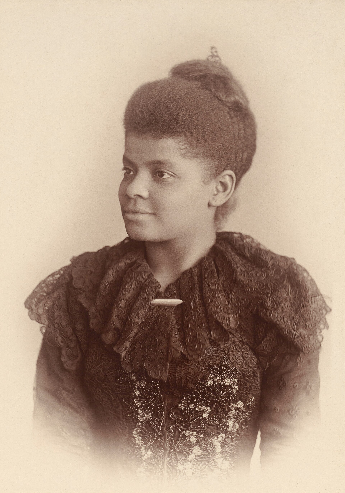{fig-alt="Studio portrait photograph of journalist Ida B. Wells-Barnett, a Black woman in a high-necked dark dress, seated and facing the camera."}

<!-- alt candidates for ida_b_wells.jpg - edit the fig-alt= above by hand.
     [claude                ] Studio portrait photograph of journalist Ida B. Wells-Barnett, a Black woman in a high-necked dark dress, seated and facing the camera.
     [sd-caption            ] Portrait of Ida B. Wells
     [file-desc             ] Ida B. Wells Barnett , in a photograph by Mary Garrity from c. 1893. This version has been cropped from the original photographic card to approximately the photo itself (the borders aren't quite straight, so I did the best crop I could manage with the restriction), and has also had dirt and speck...
-->
<!-- ALT-BLOCK:END ida_b_wells.jpg -->

::: notes
Sinclair's own verdict on The Jungle is the line worth quoting: he aimed at the
public's heart and hit its stomach. He wrote a book about *workers being destroyed*
and America responded by regulating *meat*. That is a lesson about whose suffering
registers.

Ida B. Wells belongs on this list and is usually left off it. She was doing the
hardest and most dangerous investigative journalism of the era - her Memphis newspaper
office was destroyed by a mob and she was driven out of the South under threat of
death. She counted and documented lynchings when no institution would.
:::

## Songs as primary sources

When you own the press, the courts and the police, the thing workers still have is **a song.**

- **"Which Side Are You On?"** — **Florence Reece**, Harlan County KY, **1931**. Written on a kitchen calendar the night Sheriff J.H. Blair's men ransacked her house hunting her husband. Set to a Baptist hymn tune. Later picked up by the Freedom Singers in the civil rights movement.
- **"Sixteen Tons"** — **Merle Travis**, **1946**. The company-store line came from a letter by his brother John. Tennessee Ernie Ford's 1955 cover sold **a million copies in under four weeks.**
- **"Ludlow Massacre"** — **Woody Guthrie**. A verse-by-verse account of the tent colony and the pit.
- **"John Henry"** — the steel-driving man who beats the steam drill and dies of it.

::: notes
The point for a physics class: these songs are *evidence*. When the official record is
written by the people who own the mine, the folk record is a primary source about
conditions, and historians treat it as one.

Play 30 seconds of "Which Side Are You On?" if you can - preferably the Almanac Singers
1941 version, or Florence Reece's own late recording, which is better because she is
old and furious and unaccompanied.

Ask the class what the 2026 equivalent is. It's a real question, not a rhetorical one.
:::

## John Henry, and who was holding the hammer

**John Henry** is the best-known Black folk hero in America: he races a steam drill through a mountain, wins, and dies with the hammer in his hand.

Historian **Scott Reynolds Nelson** traced him to prison records — a **19-year-old** named John William Henry, in the Virginia Penitentiary, sent to tunnel work on the **Chesapeake & Ohio Railway** in the 1870s.

If that identification holds, John Henry was a **convict laborer**, and he probably died of **silicosis** from rock dust — not a burst heart.

**Convict leasing** put thousands of Black men, arrested on minor or invented charges, into mines and tunnels across the post-Reconstruction South. Nelson's point: John Henry stands for hundreds who died anonymously.

*This will be relevant for our discussion about automation and AI in Week 7 — the oldest American song about a machine taking your job is also a song about a prisoner.*

<!-- IMG: lead_belly.jpg -->
<!-- ALT-BLOCK:BEGIN lead_belly.jpg -->
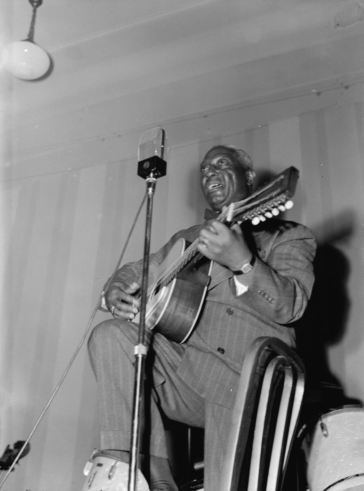{fig-alt="Photograph of the musician Lead Belly, Huddie Ledbetter, singing and playing his twelve-string guitar, taken by William Gottlieb at the National Press Club in Washington DC."}

<!-- alt candidates for lead_belly.jpg - edit the fig-alt= above by hand.
     [claude                ] Photograph of the musician Lead Belly, Huddie Ledbetter, singing and playing his twelve-string guitar, taken by William Gottlieb at the National Press Club in Washington DC.
     [file-desc             ] Leadbelly, National Press Club, Washington, D.C., between 1938 and 1948 (Photograph by William P. Gottlieb)
-->
<!-- ALT-BLOCK:END lead_belly.jpg -->

::: notes
[WEEK 7 SETUP] This is the strongest bridge in the deck to the AI material. The
American folk archetype of technological unemployment is a Black convict laborer who
wins the contest and dies anyway. When we talk about automation in Week 7, that is the
image to come back to: the question is never only "can the machine do it" but "what
happens to the person, and did anyone owe them anything."

Also flag the honest uncertainty: Nelson's identification is a strong argument, not a
proven fact, and other researchers favor Big Bend Tunnel in WV. The C&O's chief
engineer denied steam drills were even used at Big Bend. Good research-skills moment.

Lead Belly (Huddie Ledbetter, 1888/89-1949) recorded John Henry and much else. He was
"discovered" by John and Alan Lomax at Angola prison in **1933**, and the Lomaxes
initially presented him to white audiences in prison stripes as a curiosity. Worth
naming: even the preservation of Black music ran through a system that treated the
musician as property of a narrative. He shaped everything downstream - Dylan, the
Weavers, Nirvana, and by George Harrison's account, the Beatles.
:::

## The other thing that was organizing

In the same years, the **[second Ku Klux Klan](https://en.wikipedia.org/wiki/Ku_Klux_Klan)** was the fastest-growing membership organization in America.

- Refounded **24 December 1915** at Stone Mountain, GA, inspired by the film *The Birth of a Nation*
- Peak membership by **1924: an estimated 3-8 million**
- **Not just the South.** Detroit had ~40,000 members. In Indiana, ~18% of eligible men joined
- Targets: Black Americans, Catholics, Jews, and Southern and Eastern European immigrants

**Look at who was marching at Blair Mountain in 1921:** Black miners from the Deep South, Italians, Hungarians, Poles — the Klan's exact target list — armed, together, under one flag.

Solidarity was not a slogan. **It was the only strategy that could work, and everyone there knew it.**

<!-- IMG: kkk_parade_1928.jpg -->
<!-- ALT-BLOCK:BEGIN kkk_parade_1928.jpg -->
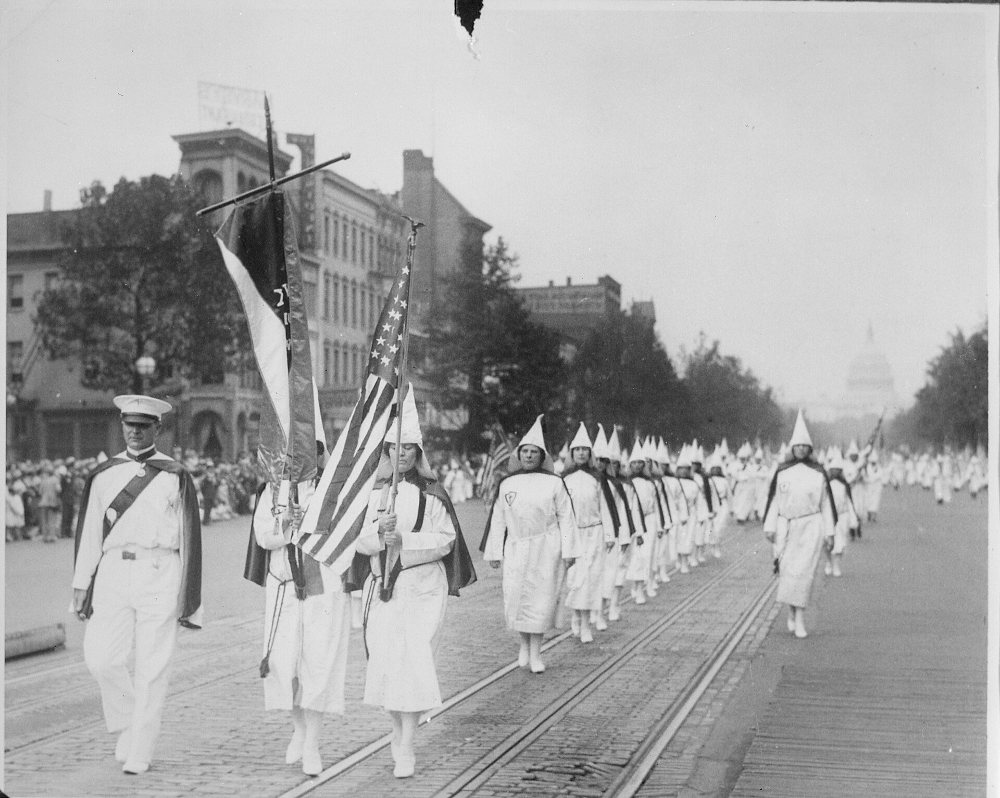{fig-alt="Photograph of thousands of robed and hooded Ku Klux Klan members marching in daylight down Pennsylvania Avenue in Washington DC in 1928, with crowds watching from the pavements and the Capitol in the distance."}

<!-- alt candidates for kkk_parade_1928.jpg - edit the fig-alt= above by hand.
     [manifest-note         ] CONTENT WARNING - decide in advance whether to show, describe, or replace with a membership map.
     [claude                ] Photograph of thousands of robed and hooded Ku Klux Klan members marching in daylight down Pennsylvania Avenue in Washington DC in 1928, with crowds watching from the pavements and the Capitol in the distance.
     [file-desc             ] Scope and content: The Capitol in the background.
-->
<!-- ALT-BLOCK:END kkk_parade_1928.jpg -->

::: notes
This is the closing moral argument of the lecture, so land it carefully.

The historiography is genuinely mixed and you should say so: the second Klan sometimes
*supported* striking white Protestant workers while opposing interracial unions. It was
not simply a company weapon. But its function in the coalfields was the same either
way - a workforce divided by race and religion cannot strike, and every operator knew
it. Division was the cheapest possible security expense.

Chuck Keeney's line from earlier is the one to repeat here: "they all understood that
if they did not work together they couldn't be effective."

Then the honest ending: it did not save them. They lost anyway, in 1921. Solidarity
was necessary and insufficient - the same verdict as the "oligarchy won" slide. What
finally changed things was law, in 1933. Which is a statement about *politics*, and
politics is the title of this lecture.

[MOTIF] Hunger Games close, if you're using it: the mockingjay wasn't a weapon, it was
a signal that other people were also refusing. The red bandana did the same job.
:::

# Where this leaves us {.divider}

## The bill always comes due somewhere

Four things to carry into Week 4:

1. **Energy is never just physics.** Every joule in this course has a supply chain, and every supply chain runs through somebody's home.
2. **The costs land on whoever has the least power to refuse.** The Susquehannock, then immigrant miners, then Black convict laborers. Week 5: the Navajo. Week 6: cobalt miners.
3. **Losing is a normal outcome.** The miners were right, brave, organized, and defeated. Courage is not a mechanism.
4. **The structures come back.** The company town is being rebuilt right now, in Texas, with better branding.

**Next week:** we put numbers on it — the *death cost* of electricity generation, per terawatt-hour, by source.

::: notes
Explicit handoff to Lecture 4. The emotional arc of today is deliberately unresolved;
next week we make it quantitative, which is both the physicist's move and a genuine
relief after this material.

Participation question to close on, if time: "Blair Mountain is a National Register
site that coal subsidiaries of Arch Coal and Massey Energy held mountaintop-removal
permits over. It was listed in 2008, removed in 2009 on a clerical technicality,
litigated, and restored on 27 June 2018. Who decides what gets remembered?"
:::

## Sources

**Wikipedia entry points** (finding aids — trace to the primary sources they cite):
[Battle of Blair Mountain](https://en.wikipedia.org/wiki/Battle_of_Blair_Mountain) ·
[Coal Wars](https://en.wikipedia.org/wiki/Coal_Wars) ·
[Company town](https://en.wikipedia.org/wiki/Company_town) ·
[Coal Region](https://en.wikipedia.org/wiki/Coal_Region) ·
[Susquehannock](https://en.wikipedia.org/wiki/Susquehannock) ·
[Ludlow Massacre](https://en.wikipedia.org/wiki/Ludlow_Massacre) ·
[Coal strike of 1902](https://en.wikipedia.org/wiki/Coal_strike_of_1902) ·
[Muckraker](https://en.wikipedia.org/wiki/Muckraker) ·
[Starbase, Texas](https://en.wikipedia.org/wiki/Starbase,_Texas) ·
[Second Industrial Revolution](https://en.wikipedia.org/wiki/Second_Industrial_Revolution) ·
[History of rail transport in the United States](https://en.wikipedia.org/wiki/History_of_rail_transport_in_the_United_States) ·
[Cornelius Vanderbilt](https://en.wikipedia.org/wiki/Cornelius_Vanderbilt) ·
[John D. Rockefeller](https://en.wikipedia.org/wiki/John_D._Rockefeller) ·
[J. P. Morgan](https://en.wikipedia.org/wiki/J._P._Morgan) ·
[Pujo Committee](https://en.wikipedia.org/wiki/Pujo_Committee) ·
[Lehigh Valley](https://en.wikipedia.org/wiki/Lehigh_Valley) ·
[Theodore Roosevelt](https://en.wikipedia.org/wiki/Theodore_Roosevelt) ·
[Pan-American Exposition](https://en.wikipedia.org/wiki/Pan-American_Exposition) ·
[Rough Riders](https://en.wikipedia.org/wiki/Rough_Riders) ·
[California Forever](https://en.wikipedia.org/wiki/California_Forever) ·
[Ku Klux Klan](https://en.wikipedia.org/wiki/Ku_Klux_Klan)

**Institutional / scholarly:** West Virginia Mine Wars Museum (wvminewars.org) · *e-WV: The West Virginia Encyclopedia* (scrip) · Smithsonian Magazine, "What Made the Battle of Blair Mountain the Largest Labor Uprising in American History" · Price V. Fishback, "Did Coal Miners 'Owe Their Souls to the Company Store'?", *Journal of Economic History* · Scott Reynolds Nelson, *Steel Drivin' Man* (2006) · Lon Savage, *Thunder in the Mountains* (1990)

**Contemporary reporting:** Texas Tribune (Starbase incorporation; HB 5246) · Scientific American (Starbase opposition) · New Republic ("Freedom Cities")

**Watch / read:** *Matewan* (dir. John Sayles, 1987) · Denise Giardina, *Storming Heaven* (1987)

::: notes
Per course policy: Wikipedia is a finding aid here, not the citation of record. Before
this goes in front of students as coursework, the .gov items (NPS, coalheritage.wv.gov)
should each be paired with an independent source - the Mine Wars Museum and the
Smithsonian piece already cover most of it.

AI-USE DISCLOSURE (per course policy) - include as a closing slide if this deck is
used as coursework:
  Model: Claude (Anthropic), claude-opus-5, session of 15-Sep-2026.
  Task: source gathering, summarization, and drafting of this outline. All factual
  claims traced to the sources listed above; no text generated without a source.
  Source material: English Wikipedia articles listed above; WV Mine Wars Museum;
  e-WV; Smithsonian Magazine; Texas Tribune; Scientific American; New Republic.
  Data centers: Anthropic runs on AWS and Google Cloud, primarily US regions
  (us-east / us-west); exact facility not disclosed by the vendor.
  Compute estimate: to be filled in from the session token count - Sal, I'll report
  the number for this session separately.
  Human authorship: outline, framing, argument and final assembly by S. Rappoccio.
:::
